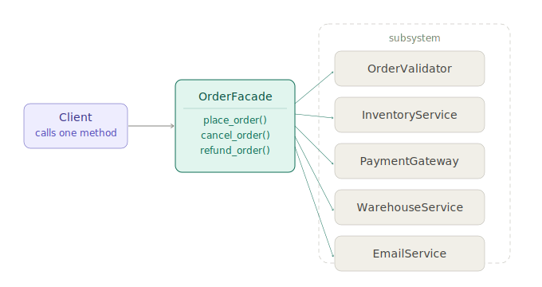

# Facade Design Pattern

## 1. What problem are we trying to solve?

Imagine you're building a feature that sends a customer a confirmation email after they place an order. Sounds simple. But the actual implementation involves multiple systems:

```python
order_validator.validate(order)
inventory_service.reserve_items(order.items)
payment_gateway.charge(order.customer.card_token, order.total)
warehouse.schedule_fulfillment(order)
email_client.send(
    to=order.customer.email,
    subject="Order confirmed",
    template="order_confirmation",
    context={"order": order},
)
audit_log.record(event="order_placed", order_id=order.id)
```

Your checkout controller now has to know about six different subsystems, their method signatures, their calling order, and what to do when they fail. Every piece of calling code must understand the entire orchestration.

Now imagine three different places in the codebase that need to place orders — a web endpoint, an admin tool, and a batch import script. All three end up with the same orchestration scattered across them.

The problem is:

> I have a complex subsystem that requires coordinating many components in a specific way, and I don't want every caller to bear the burden of knowing how to do that.

That is exactly the problem the **Facade pattern** solves.

---

## 2. Concept introduction

The **Facade pattern** provides a simplified interface over a complex subsystem.

In plain English:

> A Facade is a single, easy-to-use object that hides the complexity of a group of objects working together behind a clean doorway.

Facade is a **structural pattern**. Structural patterns are about how objects are composed and connected. Specifically, it answers:

> How do I give clients a simple entry point to a complex subsystem without rewriting the subsystem itself?

The shape is:

```text
Client code
    talks to Facade only

Facade
    knows about the subsystem components
    orchestrates them in the right order
    exposes a simpler interface

Subsystem
    many classes doing specialized work
    unchanged — Facade wraps them
```



Vocabulary:

| Term | Meaning |
|---|---|
| Client | The code that needs to trigger a complex operation |
| Facade | The simplified entry point that hides internal orchestration |
| Subsystem | The collection of specialized classes doing the real work |

The Facade does not *replace* the subsystem. Each component still exists and can still be used directly when needed. The Facade is a convenience layer that shields most callers from complexity they do not need to understand.

---

## 3. The problem without a Facade

Here is what a checkout endpoint looks like without one:

```python
class CheckoutController:
    def __init__(
        self,
        order_validator,
        inventory_service,
        payment_gateway,
        warehouse,
        email_client,
        audit_log,
    ):
        self.order_validator = order_validator
        self.inventory_service = inventory_service
        self.payment_gateway = payment_gateway
        self.warehouse = warehouse
        self.email_client = email_client
        self.audit_log = audit_log

    def post(self, order):
        self.order_validator.validate(order)
        self.inventory_service.reserve_items(order.items)
        self.payment_gateway.charge(order.customer.card_token, order.total)
        self.warehouse.schedule_fulfillment(order)
        self.email_client.send(
            to=order.customer.email,
            subject="Order confirmed",
            template="order_confirmation",
            context={"order": order},
        )
        self.audit_log.record(event="order_placed", order_id=order.id)
        return {"status": "ok"}
```

The controller depends on six systems. If `AdminOrderController` and `BatchImportService` also need to place orders, they either duplicate this orchestration or the same pattern gets copied in three places. Every new caller couples itself to the subsystem's internals.

---

## 4. Introducing the Facade

Move the orchestration into a dedicated class:

```python
class OrderFacade:
    def __init__(
        self,
        order_validator,
        inventory_service,
        payment_gateway,
        warehouse,
        email_client,
        audit_log,
    ):
        self._order_validator = order_validator
        self._inventory_service = inventory_service
        self._payment_gateway = payment_gateway
        self._warehouse = warehouse
        self._email_client = email_client
        self._audit_log = audit_log

    def place_order(self, order) -> dict:
        self._order_validator.validate(order)
        self._inventory_service.reserve_items(order.items)
        self._payment_gateway.charge(
            order.customer.card_token, order.total
        )
        self._warehouse.schedule_fulfillment(order)
        self._email_client.send(
            to=order.customer.email,
            subject="Order confirmed",
            template="order_confirmation",
            context={"order": order},
        )
        self._audit_log.record(
            event="order_placed", order_id=order.id
        )
        return {"status": "ok"}

    def cancel_order(self, order) -> dict:
        self._inventory_service.release_items(order.items)
        self._payment_gateway.refund(order.payment_id)
        self._email_client.send(
            to=order.customer.email,
            subject="Order cancelled",
            template="order_cancellation",
            context={"order": order},
        )
        self._audit_log.record(
            event="order_cancelled", order_id=order.id
        )
        return {"status": "cancelled"}
```

Now every caller reduces to:

```python
class CheckoutController:
    def __init__(self, order_facade: OrderFacade):
        self._order_facade = order_facade

    def post(self, order):
        return self._order_facade.place_order(order)
```

The controller went from knowing six systems to knowing one.

---

## 5. Natural example: video encoding pipeline

Media processing is a classic Facade territory. Encoding a video involves a chain of specialized tools: the input file needs to be read and validated, audio must be extracted and resampled, video frames need to be decoded and re-encoded at a target bitrate, thumbnails get generated, metadata gets written, and the result gets stored.

Without a Facade, any feature that needs to produce an encoded video carries the full burden:

```python
raw = MediaReader.open(source_path)
raw.validate_codec()

audio_track = AudioProcessor.extract(raw)
audio_track.resample(sample_rate=44100)

video_stream = VideoProcessor.decode(raw)
encoded = VideoEncoder.encode(video_stream, bitrate=2000)

thumbnail = ThumbnailGenerator.capture_frame(video_stream, timestamp=5.0)

output = MediaContainer.package(encoded, audio_track)
output.write_metadata(title=title, duration=raw.duration)

storage.upload(output, destination_path)
storage.upload(thumbnail, thumbnail_path)
```

A `VideoProcessingFacade` wraps this into a single call:

```python
class VideoProcessingFacade:
    def __init__(
        self,
        media_reader,
        audio_processor,
        video_encoder,
        thumbnail_generator,
        media_container,
        storage,
    ):
        self._reader = media_reader
        self._audio = audio_processor
        self._encoder = video_encoder
        self._thumbnailer = thumbnail_generator
        self._container = media_container
        self._storage = storage

    def transcode(
        self,
        source_path: str,
        destination_path: str,
        title: str,
        bitrate: int = 2000,
    ) -> dict:
        raw = self._reader.open(source_path)
        raw.validate_codec()

        audio_track = self._audio.extract(raw)
        audio_track.resample(sample_rate=44100)

        video_stream = self._encoder.decode(raw)
        encoded = self._encoder.encode(video_stream, bitrate=bitrate)

        thumbnail = self._thumbnailer.capture_frame(
            video_stream, timestamp=5.0
        )

        output = self._container.package(encoded, audio_track)
        output.write_metadata(title=title, duration=raw.duration)

        video_url = self._storage.upload(output, destination_path)
        thumbnail_url = self._storage.upload(
            thumbnail, destination_path + ".thumb.jpg"
        )

        return {
            "video_url": video_url,
            "thumbnail_url": thumbnail_url,
            "duration": raw.duration,
        }
```

Callers — an upload endpoint, a background worker, an admin re-encode script — all say the same thing:

```python
result = video_facade.transcode(
    source_path=uploaded_file,
    destination_path=f"videos/{video_id}.mp4",
    title=video.title,
)
```

They do not know whether encoding uses FFmpeg or a cloud API, whether thumbnails are JPEG or WebP, or how audio resampling works.

---

## 6. Connection to earlier learned concepts and SOLID

### Facade versus Adapter

Facade and Adapter are often confused because both wrap existing things. The distinction is intent.

| Pattern | What it wraps | Why |
|---|---|---|
| Adapter | One incompatible object | Make its interface fit the one you expect |
| Facade | Many objects in a subsystem | Simplify the combined interface for common use cases |

An Adapter says: "this object speaks the wrong language."

A Facade says: "this group of objects is fine — I just want a simpler doorway into them."

### Single Responsibility Principle

Without a Facade, the orchestration responsibility leaks into every caller. The checkout controller, admin tool, and batch importer all become responsible for *how orders are placed*, not just *when*. The Facade centralizes that responsibility. Each caller then has one job: handle the request. The Facade has one job: orchestrate the subsystem.

### Dependency Inversion Principle

The Facade becomes an abstraction that callers depend on, rather than depending directly on concrete subsystem classes. `CheckoutController` depends on `OrderFacade`, not on `InventoryService` and `PaymentGateway` directly. This makes it much easier to swap implementations, write tests, or change what "placing an order" means without touching callers.

### Open/Closed Principle

Callers are shielded from internal changes. If you switch payment processors from Stripe to Adyen, only the Facade changes — all callers remain untouched.

### The main risk: the god object

Facade does not eliminate the subsystem's complexity — it moves it into one place. The Facade class itself can grow. If every operation in a domain gets added to one Facade, it becomes a "god object" that knows too much:

```python
# Too much — this is no longer a Facade, it's a service blob
class OrderFacade:
    def place_order(self, order): ...
    def cancel_order(self, order): ...
    def refund_order(self, order): ...
    def generate_invoice(self, order): ...
    def export_orders_csv(self, date_range): ...
    def get_order_analytics(self, period): ...
    def notify_supplier(self, order): ...
```

Split by concern when this happens.

---

## 7. Example from a popular Python package: scikit-learn Pipeline

scikit-learn's `Pipeline` is one of the clearest real-world Facades in the Python data science ecosystem.

A typical ML workflow involves multiple steps: imputing missing values, scaling features, encoding categoricals, and finally fitting a model. Without Pipeline, you would orchestrate all of this manually:

```python
from sklearn.impute import SimpleImputer
from sklearn.preprocessing import StandardScaler
from sklearn.linear_model import LogisticRegression

imputer = SimpleImputer(strategy="mean")
scaler = StandardScaler()
model = LogisticRegression()

X_train_imputed = imputer.fit_transform(X_train)
X_train_scaled = scaler.fit_transform(X_train_imputed)
model.fit(X_train_scaled, y_train)

X_test_imputed = imputer.transform(X_test)
X_test_scaled = scaler.transform(X_test_imputed)
predictions = model.predict(X_test_scaled)
```

Every caller — training scripts, cross-validation loops, hyperparameter searches — must know this choreography: `fit_transform` on train, `transform`-only on test, in the right order, without leaking.

`Pipeline` is the Facade:

```python
from sklearn.pipeline import Pipeline

pipe = Pipeline([
    ("imputer", SimpleImputer(strategy="mean")),
    ("scaler", StandardScaler()),
    ("model", LogisticRegression()),
])

pipe.fit(X_train, y_train)
predictions = pipe.predict(X_test)
```

The Pipeline hides which steps require `fit_transform` versus `transform`, that they must happen in a fixed order, and that data must flow correctly from one step to the next.

This is the Facade in action: a complex, stateful, ordered multi-step process reduced to `.fit()` and `.predict()` — the same interface as any single estimator. `GridSearchCV` and `cross_val_score` can use it just like a simple model, completely unaware of what is inside.

---

## 8. When to use and when not to use

### When to use

Use Facade when:

| Situation | Why Facade helps |
|---|---|
| Clients need to orchestrate many subsystem objects | Centralizes the orchestration |
| The same orchestration appears in multiple places | Eliminates duplication |
| Subsystem internals are likely to change | Shields callers from changes |
| You want callers to depend on a simpler interface | Enables easier testing and mocking |
| Onboarding new team members | One Facade method is easier to explain than six coordination steps |

Good fits: order processing, payment flows, video encoding, email sending, user registration, report generation.

### When not to use

Do not use Facade when the caller genuinely needs fine-grained control. If you are writing the payment service itself, you probably need direct access to the payment gateway — a Facade would get in the way. The Facade is for callers who want the outcome, not those who need to control every step.

Also avoid it if the "facade" would just delegate to a single method:

```python
class UserFacade:
    def create(self, name, email):
        return self._user_repo.save(User(name, email))
```

This wraps one thing and adds nothing. It is not a Facade — it is a wrapper with no payoff.

---

## 9. Practical rule of thumb

Ask:

> Do my callers need to coordinate more than two or three objects to accomplish something?

If yes, a Facade probably belongs there.

Ask:

> Is the same multi-step orchestration appearing in more than one place?

If yes, that is the Facade's natural home.

Ask:

> Is the caller's job to *trigger* this operation, not to *control* it?

If yes — a checkout controller should not know about inventory reservation — a Facade is a good fit.

Ask:

> Am I just wrapping a single method call?

If yes, skip the Facade.

The key mental test: if you removed the Facade and asked a new team member to add a third place in the app that places orders, would they have to read through existing code to understand the orchestration? If yes, the Facade belongs there.

---

## 10. Summary and mental model

The Facade pattern provides a simplified interface over a complex subsystem. The subsystem components remain available for those who need direct access — the Facade just provides a friendlier entry point for the common case.

Mental model — think of a hotel concierge. The hotel has a restaurant, a spa, a taxi service, a room service kitchen, and a laundry. You *could* call each one directly. But the concierge knows how to coordinate all of them on your behalf. You say "I need dinner at 7 and a taxi at 9" — they handle the rest. The kitchen and taxi company still exist and can still be called directly if needed, but for most guests the concierge is the right interface.

The key contrast with nearby structural patterns:

| Pattern | Main job |
|---|---|
| Adapter | Make an incompatible object fit an expected interface |
| Facade | Simplify many objects behind one cleaner interface |
| Bridge | Decouple two independently varying hierarchies |
| Decorator | Add behaviour to an object without changing its interface |
| Composite | Treat individual objects and groups uniformly through a shared interface |

In one sentence:

> Use Facade when callers should not have to know how a subsystem works internally — just what they can ask it to do.

---

[Home](../../index.md)
