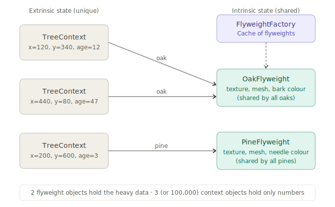

# Flyweight Design Pattern

## 1. What problem are we trying to solve?

Imagine you're building a forest simulation. The forest has 100,000 trees. Each tree has:

- a species (oak, pine, birch)
- a texture (a large image, shared across all oaks)
- a mesh geometry (also shared)
- a position (x, y) — unique to each tree
- an age (unique to each tree)

If you create 100,000 `Tree` objects each storing their own copy of the texture and geometry, you've blown your memory. The texture alone might be 2MB. 100,000 copies = 200GB. The program crashes before the forest gets off the ground.

The naïve model looks like this:

```python
@dataclass
class Tree:
    x: float
    y: float
    age: int
    species: str
    texture: bytes        # 2MB per tree
    mesh_data: bytes      # 500KB per tree
```

100,000 trees × ~2.5MB = roughly 250GB of RAM. That's not a memory concern. That's a memory catastrophe.

But here's the thing: the texture and mesh for every oak tree is *identical*. You only need one copy. The unique data per tree is tiny: just `x`, `y`, and `age`.

The problem is:

> We need to create a huge number of objects that share most of their state. Storing the shared data in every object wastes enormous memory.

---

## 2. Concept introduction

The **Flyweight pattern** reduces memory usage by sharing common state across many objects instead of storing it in each one.

In plain English:

> Split an object's data into two parts: the *intrinsic* state (shared, immutable, stored once) and the *extrinsic* state (unique per instance, passed in from outside). Store many flyweights referring to the same intrinsic data.

Flyweight is a **structural pattern** — it's about how objects are composed and stored in memory. It answers:

> How do I support a large number of fine-grained objects without the memory cost of storing all their state independently?

The vocabulary:

| Term | Meaning |
|---|---|
| Intrinsic state | Data that is the *same* across many objects — stored once in the flyweight |
| Extrinsic state | Data that is *unique* per instance — passed in at use time |
| Flyweight | The lightweight shared object holding only intrinsic state |
| Flyweight factory | The cache that ensures you get one flyweight per unique intrinsic state |
| Context / client | The thing that holds extrinsic state and passes it to the flyweight |

The key mental shift: instead of one fat object per instance, you have one *flyweight* (shared, reused) plus a thin *context* (unique per instance) that passes its extrinsic data to the flyweight when needed.



---

## 3. Intrinsic versus extrinsic state — the core split

Before writing any code, you must answer one design question:

**Which fields are the same for all instances of a given "type"?** Those are intrinsic — they go into the flyweight. **Which fields are different per instance?** Those are extrinsic — they stay outside the flyweight and are passed in when needed.

For the forest:

| Field | Which kind? | Why |
|---|---|---|
| `species` | Intrinsic | Defines the flyweight's identity |
| `texture` | Intrinsic | Same for all oaks |
| `mesh_data` | Intrinsic | Same for all oaks |
| `x`, `y` | Extrinsic | Different for every tree |
| `age` | Extrinsic | Different for every tree |

The intrinsic state must be **immutable**. If a flyweight changed its texture, it would accidentally change the appearance of every tree sharing it. The extrinsic state is mutable and lives with the context.

---

## 4. Minimal Python example

```python
from __future__ import annotations
from dataclasses import dataclass


@dataclass(frozen=True)
class TreeType:
    """Flyweight — holds intrinsic (shared, heavy) state."""
    species: str
    texture: bytes       # imagine 2MB of image data
    mesh_data: bytes     # imagine 500KB of geometry


class TreeTypeFactory:
    """Ensures only one TreeType per species is ever created."""
    _cache: dict[str, TreeType] = {}

    @classmethod
    def get(cls, species: str, texture: bytes, mesh_data: bytes) -> TreeType:
        if species not in cls._cache:
            cls._cache[species] = TreeType(species, texture, mesh_data)
            print(f"  [factory] created flyweight for '{species}'")
        return cls._cache[species]


@dataclass
class Tree:
    """Context — holds extrinsic (unique, lightweight) state."""
    x: float
    y: float
    age: int
    tree_type: TreeType   # reference to the shared flyweight

    def draw(self) -> None:
        print(
            f"Drawing {self.tree_type.species} at ({self.x}, {self.y}), "
            f"age {self.age} [texture id: {id(self.tree_type.texture)}]"
        )


# Usage
oak_texture = b"oak_texture_data"
oak_mesh = b"oak_mesh_data"
pine_texture = b"pine_texture_data"
pine_mesh = b"pine_mesh_data"

forest: list[Tree] = [
    Tree(10, 20, 5,  TreeTypeFactory.get("oak",  oak_texture,  oak_mesh)),
    Tree(50, 80, 12, TreeTypeFactory.get("oak",  oak_texture,  oak_mesh)),
    Tree(30, 60, 3,  TreeTypeFactory.get("pine", pine_texture, pine_mesh)),
    Tree(90, 10, 8,  TreeTypeFactory.get("oak",  oak_texture,  oak_mesh)),
]

for tree in forest:
    tree.draw()
```

Output:
```
  [factory] created flyweight for 'oak'
  [factory] created flyweight for 'pine'
Drawing oak at (10, 20), age 5 [texture id: 140234...]
Drawing oak at (50, 80), age 12 [texture id: 140234...]   ← same id!
Drawing pine at (30, 60), age 3 [texture id: 140235...]
Drawing oak at (90, 10), age 8 [texture id: 140234...]   ← same id!
```

Three oak trees, but only one texture object in memory. The factory created exactly two flyweights regardless of how many trees you plant.

---

## 5. Natural example: a text editor with character formatting

A text editor is the classic Flyweight scenario from the GoF book. Imagine a 500-page document. Each character on each page is an object. That's easily a million characters.

Each character has:
- its glyph (the letter 'A') — intrinsic, shared across all 'A's
- its font family — intrinsic per style
- its font size — intrinsic per style
- its colour — intrinsic per style
- its position in the document — extrinsic, unique per character

```python
from __future__ import annotations
from dataclasses import dataclass


@dataclass(frozen=True)
class CharacterStyle:
    """Flyweight — font, size, colour are the same for every 'A' in bold 12pt red."""
    glyph: str
    font_family: str
    font_size: int
    colour: str

    def render(self, x: int, y: int) -> None:
        print(f"Render '{self.glyph}' at ({x},{y}) — {self.font_family} {self.font_size}pt {self.colour}")


class StyleFactory:
    _styles: dict[tuple, CharacterStyle] = {}

    @classmethod
    def get_style(cls, glyph: str, font: str, size: int, colour: str) -> CharacterStyle:
        key = (glyph, font, size, colour)
        if key not in cls._styles:
            cls._styles[key] = CharacterStyle(glyph, font, size, colour)
        return cls._styles[key]

    @classmethod
    def style_count(cls) -> int:
        return len(cls._styles)


@dataclass
class Character:
    """Context — position is unique per character instance."""
    x: int
    y: int
    style: CharacterStyle   # shared flyweight

    def render(self) -> None:
        self.style.render(self.x, self.y)


# Build a paragraph — "Hello" in 12pt bold, then " world" in 10pt normal
factory = StyleFactory

document = [
    Character(0,   0, factory.get_style('H', 'Arial', 12, 'black')),
    Character(10,  0, factory.get_style('e', 'Arial', 12, 'black')),
    Character(18,  0, factory.get_style('l', 'Arial', 12, 'black')),
    Character(24,  0, factory.get_style('l', 'Arial', 12, 'black')),  # reuses 'l' flyweight!
    Character(30,  0, factory.get_style('o', 'Arial', 12, 'black')),
    Character(40,  0, factory.get_style(' ', 'Arial', 10, 'gray')),
    Character(45,  0, factory.get_style('w', 'Arial', 10, 'gray')),
    Character(54,  0, factory.get_style('o', 'Arial', 10, 'gray')),   # different flyweight — 10pt gray
    Character(62,  0, factory.get_style('r', 'Arial', 10, 'gray')),
    Character(68,  0, factory.get_style('l', 'Arial', 10, 'gray')),
    Character(74,  0, factory.get_style('d', 'Arial', 10, 'gray')),
]

for char in document:
    char.render()

print(f"\n{len(document)} characters, {factory.style_count()} unique flyweights")
```

Output:
```
Render 'H' at (0,0) — Arial 12pt black
...
11 characters, 9 unique flyweights
```

Those two `'l'` characters in "Hello" share one `CharacterStyle` object. With a full novel — millions of characters — the number of unique flyweights stays in the low hundreds (one per unique glyph/font/size/colour combination), while the context objects number in the millions.

---

## 6. Connection to earlier concepts and SOLID

**Flyweight and the Factory pattern** are almost always paired. The flyweight factory is what prevents duplication — it's the cache that returns an existing flyweight instead of creating a new one. Without it, callers would accidentally create multiple copies of the same heavy object, defeating the purpose entirely.

```python
# Without factory — callers accidentally create duplicates
oak1 = TreeType("oak", texture_bytes, mesh_bytes)
oak2 = TreeType("oak", texture_bytes, mesh_bytes)  # separate object, wastes memory

# With factory — guaranteed single instance per species
oak1 = TreeTypeFactory.get("oak", ...)
oak2 = TreeTypeFactory.get("oak", ...)  # same object
```

**Flyweight and Singleton** are related but distinct. A Singleton ensures exactly one instance of a *class*. A flyweight factory ensures one instance per *unique intrinsic state* — you might have one oak flyweight, one pine flyweight, one birch flyweight. It's a *pool* of singletons, keyed by intrinsic state.

**Flyweight and Prototype** sometimes appear together. If creating a flyweight from scratch is expensive, the factory can use `deepcopy` of a prototype to create each new flyweight. Prototype handles creation; flyweight handles reuse.

**Flyweight and the Single Responsibility Principle**: the pattern naturally separates two responsibilities that often get tangled — the heavy rendering/data logic lives in the flyweight, while the per-instance position/state logic lives in the context. Each class has a clearly narrower job.

**Flyweight and the Open/Closed Principle**: adding a new species means adding a new flyweight the factory can cache — the context class and the factory's `get()` logic don't need to change.

**Where Flyweight can conflict with SOLID**: the extrinsic state must be passed into the flyweight at call time, which means the flyweight's methods have an unusual signature — they take context data as parameters rather than reading it from `self`. This can feel a little odd and makes the interface slightly less clean. The tradeoff is explicit: you accept a less intuitive API in exchange for memory efficiency.

---

## 7. Example from a popular Python package: `sys.intern` and CPython's small integer cache

Python itself uses Flyweight in two very visible places.

**Small integer caching**: CPython pre-creates integer objects for values -5 through 256. When you write `a = 42` and `b = 42`, both variables point to the *same* integer object in memory.

```python
a = 42
b = 42
print(a is b)   # True — same object

a = 1000
b = 1000
print(a is b)   # False (usually) — outside the cached range
```

The integers -5 to 256 are flyweights. Their "intrinsic state" is their value. Their "extrinsic state" is how your code uses them (variable name, expression context) — but since integers are immutable, there really is no meaningful extrinsic state. The pattern is purely about memory.

**`sys.intern`**: Python lets you explicitly intern strings, ensuring only one string object exists per unique value. This is a direct Flyweight mechanism for strings — useful when you have many repeated string keys (like column names in a large dataset).

```python
import sys

a = sys.intern("column_name")
b = sys.intern("column_name")
print(a is b)   # True — same object, not just equal
```

In data science, `pandas` does something similar under the hood with `Categorical` dtype. When you have a Series with 10 million rows but only 50 unique string values (like country codes, product categories), `pd.Categorical` stores the unique strings once and represents each row as an integer index into that lookup table — structurally identical to Flyweight.

```python
import pandas as pd

s = pd.Series(["US", "UK", "DE", "US", "UK"] * 2_000_000)
print(s.memory_usage(deep=True))            # ~160MB — one string object per row

cat = s.astype("category")
print(cat.memory_usage(deep=True))          # ~10MB — 5 unique strings + integer codes
```

The `categories` (US, UK, DE) are the flyweights — shared, stored once. The integer codes are the extrinsic state — one per row, tiny.

---

## 8. When to use and when not to use

Use Flyweight when:

| Situation | Why Flyweight helps |
|---|---|
| Huge number of similar objects | The pattern only pays off at scale — thousands or more |
| Most state is shared across instances | The intrinsic/extrinsic split must be natural and meaningful |
| Memory is the bottleneck | Flyweight trades CPU complexity for memory savings |
| Objects are mostly immutable | Intrinsic state must not change, or all sharers break |
| You can cleanly separate intrinsic from extrinsic state | If the split is forced or unclear, the design will fight you |

Good fits: game engines (tiles, particles, enemies), text rendering (glyphs), GIS systems (map tiles, terrain features), large simulations (molecules, agents), data processing pipelines with repeated categorical values.

Avoid Flyweight when:

- You have a *small* number of objects. The pattern adds real complexity — a factory, split objects, extrinsic state passed around. That complexity is only worthwhile at scale.
- The shared state is trivial (a few integers). Flyweight makes sense when intrinsic state is *heavy* — large images, complex meshes, loaded configuration.
- The intrinsic/extrinsic split is unclear or artificial. If you're contorting your model to make the split work, the pattern isn't the right fit.
- Correctness is tricky. If flyweights need to be updated (changing a texture that affects all oaks), you need careful coordination. Mutable shared state in flyweights is a footgun.

---

## 9. Practical rule of thumb

Ask:

> Am I creating thousands (or more) of objects that have the same large chunk of data repeated in each one?

If yes, Flyweight is probably worth considering.

Ask:

> Can I clearly separate the data into "shared by all instances of the same type" and "unique per instance"?

If yes, the split is natural. Proceed. If the separation requires awkward contortion, look elsewhere.

Ask:

> Is the shared data immutable — or can I make it immutable?

If no, Flyweight is risky. Shared mutable state across thousands of objects is a debugging nightmare.

Ask:

> Is memory actually the problem here, or am I prematurely optimising?

Only reach for Flyweight when you have a real memory constraint, not as a default design choice. A `@dataclass` with a plain field is almost always the right starting point.

The clearest practical signal: if you profile your application and find memory dominated by many objects with duplicate large fields — that's Flyweight territory.

---

## 10. Summary and mental model

Flyweight is a structural pattern that saves memory by sharing common state across a large number of objects instead of storing copies in each one.

The mental model: think of a **stamp and ink pad**. Every time you stamp a letter, you're producing a unique impression at a unique position on a unique page (extrinsic state). But the stamp itself — the shape, the design, the rubber — is shared. You have one stamp, many impressions. The stamp is the flyweight. The position on the page is the extrinsic state.

```
Without Flyweight:   100,000 trees × 2.5MB each = 250GB
With Flyweight:      3 flyweights × 2.5MB each = 7.5MB
                     100,000 contexts × ~24 bytes each = ~2.4MB
                     Total ≈ 10MB
```

The key contrast with the structural patterns you've seen:

| Pattern | Main job |
|---|---|
| Adapter | Make an incompatible object fit an expected interface |
| Bridge | Decouple two independent dimensions so both can grow without M×N explosion |
| Decorator | Add behaviour to an object without changing its interface |
| Composite | Treat individual objects and groups uniformly through a shared interface |
| Facade | Simplify many objects behind one cleaner interface |
| **Flyweight** | **Share common state across many objects to reduce memory** |

In one sentence:

> Use Flyweight when you have a large number of objects that share most of their state — split the shared (intrinsic) state into a cached flyweight and keep only the unique (extrinsic) state in the context objects.

---

[Home](../../index.md)
