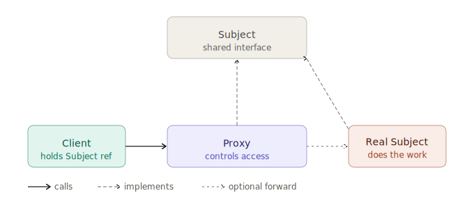
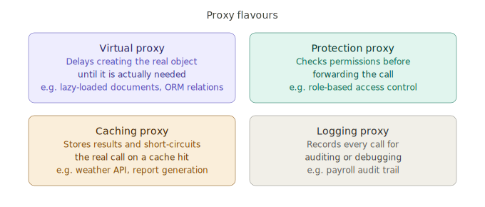

# Proxy Design Pattern

## 1. What problem are we trying to solve?

Imagine you have a `DocumentRepository` that loads documents from a database. Each document can be several megabytes — it embeds images, revision history, and all its content. Your application displays a list of 50 documents in a sidebar, showing just title and author. It does not need to load the full content of any of them yet.

```python
class DocumentRepository:
    def get_all(self) -> list[Document]:
        return [self._load_full_document(id) for id in self._all_ids()]
```

Every time the sidebar loads, you are fetching full documents you do not need. The user clicks one document — then you need it. But you loaded 49 others for nothing.

Or consider a different flavour of the same problem: you have a sensitive `PayrollService` that only managers should be able to call. But your `EmployeeDashboard` holds a direct reference to it. Any code that gets a reference to the dashboard can now call `get_salaries()`, with no checks in sight.

Or this: you have an `AnalyticsService` that makes expensive remote API calls. During testing, you want those calls to go to a fake instead of the real thing — but the test code holds a `service` reference typed as `AnalyticsService`, and you do not want to change that type.

In all three cases, the problem is not the object's *interface* (that is fine) and it is not its *implementation* (that works correctly). The problem is *access to the object itself*:

> You need to control, delay, or intercept access to an object — without the caller knowing anything changed.

That is the problem Proxy solves.

---

## 2. Concept introduction

The **Proxy pattern** provides a substitute object that controls access to a real object.

In plain English:

> A proxy stands in front of the real object. It has the same interface, so callers treat it identically. But the proxy intercepts every call and decides what to do: forward it immediately, delay it, check permissions first, cache the result, or log what happened.

Proxy is a **structural pattern** — it is about how objects are composed. It answers:

> How do I intercept or control access to an object without changing the object itself or the code that uses it?

The shape is:

```
Client  →  Proxy  →  Real object
```

Both the Proxy and the real object implement the same interface. The client holds a reference typed as that interface. It cannot tell whether it is talking to the real object or a proxy.



The vocabulary:

| Term | Meaning |
|---|---|
| Subject | The shared interface both proxy and real object implement |
| Real subject | The actual object doing the work |
| Proxy | The substitute that controls access to the real subject |
| Client | Code that holds a reference to the subject interface |

There are several classical flavours of Proxy, each controlling access differently.



---

## 3. Virtual proxy: lazy loading

The most common proxy in everyday Python is the **virtual proxy** — it stands in for an expensive object until the moment you actually need it.

```python
from abc import ABC, abstractmethod


class Document(ABC):
    @abstractmethod
    def get_title(self) -> str: ...

    @abstractmethod
    def get_content(self) -> str: ...

    @abstractmethod
    def get_author(self) -> str: ...
```

The real implementation hits the database:

```python
class DatabaseDocument(Document):
    def __init__(self, document_id: int):
        print(f"Loading full document {document_id} from database...")
        self._id = document_id
        self._title = f"Document {document_id}"
        self._content = "...full content, embedded images, history..."
        self._author = "Alice"

    def get_title(self) -> str:
        return self._title

    def get_content(self) -> str:
        return self._content

    def get_author(self) -> str:
        return self._author
```

The virtual proxy delays that load:

```python
class LazyDocumentProxy(Document):
    def __init__(self, document_id: int):
        self._document_id = document_id
        self._real_document: DatabaseDocument | None = None

    def _load(self) -> DatabaseDocument:
        if self._real_document is None:
            self._real_document = DatabaseDocument(self._document_id)
        return self._real_document

    def get_title(self) -> str:
        return self._load().get_title()

    def get_content(self) -> str:
        return self._load().get_content()

    def get_author(self) -> str:
        return self._load().get_author()
```

Usage:

```python
documents = [LazyDocumentProxy(i) for i in range(1, 51)]

# The sidebar renders — only titles needed
for doc in documents:
    print(doc.get_title())   # no DB load yet

# User clicks the first document
print(documents[0].get_content())  # Loading full document 1 from database...
```

No database calls happen during the sidebar render. The real object is only created the moment `get_content()` is called. The caller never knew it was talking to a proxy.

---

## 4. Protection proxy: access control

The **protection proxy** checks whether the caller is allowed to do what they are trying to do, before forwarding.

```python
class PayrollService(ABC):
    @abstractmethod
    def get_salaries(self) -> list[dict]: ...

    @abstractmethod
    def process_payroll(self) -> None: ...


class RealPayrollService(PayrollService):
    def get_salaries(self) -> list[dict]:
        return [{"name": "Alice", "salary": 80_000}]

    def process_payroll(self) -> None:
        print("Processing payroll...")


class PayrollServiceProxy(PayrollService):
    def __init__(self, real_service: RealPayrollService, current_user_role: str):
        self._service = real_service
        self._role = current_user_role

    def get_salaries(self) -> list[dict]:
        if self._role not in {"manager", "hr", "finance"}:
            raise PermissionError("Only managers, HR, and finance may view salaries.")
        return self._service.get_salaries()

    def process_payroll(self) -> None:
        if self._role != "finance":
            raise PermissionError("Only finance may process payroll.")
        self._service.process_payroll()
```

Same interface. Same call site. But the proxy enforces access rules invisibly:

```python
service = PayrollServiceProxy(RealPayrollService(), current_user_role="engineer")
service.get_salaries()   # PermissionError: Only managers, HR, and finance...
```

`RealPayrollService` stays clean — it contains no permission-checking code. The protection logic lives entirely in the proxy.

---

## 5. Caching proxy

The **caching proxy** remembers previous results and short-circuits the real call when a cached answer exists.

```python
from dataclasses import dataclass


@dataclass(frozen=True)
class WeatherReport:
    city: str
    temperature: float
    condition: str


class WeatherService(ABC):
    @abstractmethod
    def get_report(self, city: str) -> WeatherReport: ...


class RemoteWeatherService(WeatherService):
    def get_report(self, city: str) -> WeatherReport:
        print(f"Calling remote API for {city}...")
        return WeatherReport(city=city, temperature=18.5, condition="Cloudy")


class CachingWeatherProxy(WeatherService):
    def __init__(self, real_service: WeatherService):
        self._service = real_service
        self._cache: dict[str, WeatherReport] = {}

    def get_report(self, city: str) -> WeatherReport:
        if city in self._cache:
            print(f"Cache hit for {city}")
            return self._cache[city]

        result = self._service.get_report(city)
        self._cache[city] = result
        return result
```

Three calls for London, one remote call:

```python
proxy = CachingWeatherProxy(RemoteWeatherService())
proxy.get_report("London")   # Calling remote API for London...
proxy.get_report("London")   # Cache hit for London
proxy.get_report("London")   # Cache hit for London
```

---

## 6. Natural example: a logging proxy for auditing

A real system often needs an audit trail of every sensitive operation. You do not want to scatter logger calls inside the real objects — that mixes auditing concerns into business logic.

A logging proxy handles it transparently.

```python
import datetime
from abc import ABC, abstractmethod


class OrderService(ABC):
    @abstractmethod
    def place_order(self, order_data: dict) -> str: ...

    @abstractmethod
    def cancel_order(self, order_id: str) -> None: ...

    @abstractmethod
    def refund_order(self, order_id: str, amount: float) -> None: ...


class RealOrderService(OrderService):
    def place_order(self, order_data: dict) -> str:
        return "order-123"

    def cancel_order(self, order_id: str) -> None:
        print(f"Order {order_id} cancelled.")

    def refund_order(self, order_id: str, amount: float) -> None:
        print(f"Refunded £{amount:.2f} for {order_id}.")


class AuditingOrderProxy(OrderService):
    def __init__(self, real_service: OrderService, user_id: str):
        self._service = real_service
        self._user_id = user_id

    def _log(self, operation: str, details: str) -> None:
        timestamp = datetime.datetime.now().isoformat()
        print(f"[AUDIT] {timestamp} user={self._user_id} op={operation} {details}")

    def place_order(self, order_data: dict) -> str:
        result = self._service.place_order(order_data)
        self._log("place_order", f"order_id={result} items={order_data.get('items')}")
        return result

    def cancel_order(self, order_id: str) -> None:
        self._service.cancel_order(order_id)
        self._log("cancel_order", f"order_id={order_id}")

    def refund_order(self, order_id: str, amount: float) -> None:
        self._service.refund_order(order_id, amount)
        self._log("refund_order", f"order_id={order_id} amount={amount}")
```

Usage:

```python
service = AuditingOrderProxy(RealOrderService(), user_id="manager-42")
order_id = service.place_order({"items": ["widget", "gadget"]})
service.refund_order(order_id, 49.99)
```

Output:

```text
[AUDIT] 2025-05-07T... user=manager-42 op=place_order order_id=order-123 items=['widget', 'gadget']
Refunded £49.99 for order-123.
[AUDIT] 2025-05-07T... user=manager-42 op=refund_order order_id=order-123 amount=49.99
```

`RealOrderService` has no logging code. `AuditingOrderProxy` has no order logic. Each class has one responsibility.

---

## 7. Connection to earlier learned concepts and SOLID

### Proxy versus Adapter

These two are the most commonly confused structural patterns. Both wrap an object, but their intent is opposite.

| Pattern | Interface | Intent |
|---|---|---|
| Adapter | Changes the interface | Make an incompatible object fit what the client expects |
| Proxy | Preserves the interface | Control access to an object the client already knows how to use |

An Adapter is a translator. A Proxy is a gatekeeper.

### Proxy versus Decorator

This distinction is subtle but important. In practice the implementation looks identical — both wrap an object and implement the same interface.

| Pattern | Same interface? | Intent |
|---|---|---|
| Decorator | Yes | Add new behaviour (logging output, compressing data, retrying) |
| Proxy | Yes | Control access (lazy load, permission check, cache) |

A rough rule: if removing the wrapper changes what the object *does*, it is a Decorator. If removing the wrapper changes whether the object *can be reached*, it is a Proxy.

### Proxy versus Facade

Facade simplifies access to many objects. Proxy controls access to one object.

| Pattern | How many objects? | What it does |
|---|---|---|
| Facade | Many (subsystem) | Hides complexity behind a simpler entry point |
| Proxy | One | Controls access to a single object |

### SOLID principles

**Single Responsibility Principle** — the proxy owns one cross-cutting concern. `PayrollServiceProxy` owns access control. `RealPayrollService` owns payroll logic. They do not mix.

**Open/Closed Principle** — you can add caching or logging to any service by wrapping it in a proxy, without modifying the service itself.

**Liskov Substitution Principle** — this is Proxy's core requirement. The proxy and the real object must be substitutable. Callers must not be able to tell the difference by the interface they interact with. If the proxy throws on inputs that the real object would accept for authorised callers, that is fine — it is an intended constraint, not a broken contract.

**Dependency Inversion Principle** — callers depend on the `Subject` interface, not on whether they are talking to a proxy or the real thing. Proxy is only possible because callers are already depending on the abstraction. If a caller held a concrete `DatabaseDocument` reference, you could not insert a `LazyDocumentProxy` in front of it.

**Interface Segregation Principle** — a proxy must implement the same interface as the real object. If that interface is too large, the proxy must forward many methods it does not care about. That is a sign the interface needs splitting, not that proxies are bad.

---

## 8. Example from a popular Python package

SQLAlchemy's lazy-loading is one of the most widely used virtual proxies in the Python ecosystem.

When you load an `Order` from the database, SQLAlchemy does not immediately load the related `Customer` object. Instead it puts a proxy in place of `order.customer`. The moment you access any attribute on that proxy — `order.customer.email` — SQLAlchemy fires a database query and populates the real object.

```python
from sqlalchemy.orm import DeclarativeBase, relationship, mapped_column, Mapped
import sqlalchemy as sa


class Base(DeclarativeBase):
    pass


class Customer(Base):
    __tablename__ = "customers"
    id: Mapped[int] = mapped_column(primary_key=True)
    name: Mapped[str]


class Order(Base):
    __tablename__ = "orders"
    id: Mapped[int] = mapped_column(primary_key=True)
    customer_id: Mapped[int] = mapped_column(sa.ForeignKey("customers.id"))
    customer: Mapped["Customer"] = relationship(lazy="select")  # lazy proxy default
```

Usage:

```python
order = session.get(Order, 1)
print(order.customer.name)   # SELECT fires here, not when the order was loaded
```

The proxy implements the `Customer` interface. When you first access any attribute, the proxy fires a `SELECT` query, populates a real `Customer` object, and from that point forward behaves identically to a real `Customer`. The application code never explicitly knows there was a proxy.

The `lazy="dynamic"` relationship goes further — it returns a proxy that exposes a query object instead of a list. You call `.filter()`, `.limit()`, and `.all()` on it just as you would a SQLAlchemy `Query`. The real database call only happens when you iterate. This is the virtual proxy pattern at scale: SQLAlchemy wraps potentially millions of related objects behind proxies to avoid loading everything eagerly.

---

## 9. When to use and when not to use

Use Proxy when:

| Situation | Proxy type | Why it helps |
|---|---|---|
| Object is expensive to create or load | Virtual | Pay the creation cost only when needed |
| Some callers should not be allowed access | Protection | Centralise permission checks in one place |
| The same call happens repeatedly with the same inputs | Caching | Pay the computation cost only once |
| You need an audit trail of every call | Logging | Record without touching the real object |
| The real object lives on another machine | Remote | A local object stands in for a remote one |
| You want to wrap a third-party object with extra behaviour | Any | Without modifying the third-party code |

Do not use Proxy when:

- **The object is cheap to create.** A virtual proxy over a `Point(x=10, y=20)` adds indirection with no benefit. Proxy earns its overhead at scale — many objects, or objects that are genuinely expensive.
- **You would just be forwarding every method unchanged.** If the proxy does nothing — no checks, no caching, no logging — it is a wrapper that adds complexity for no reason.
- **You want to translate the interface.** That is Adapter territory, not Proxy.
- **You want to add behaviour to every call as a feature.** If the concern is orthogonal feature-addition (compress every response, retry on failure), Decorator signals that intent more clearly.
- **The access check would be simpler as a guard clause.** If there is one call site and the check is two lines, a proxy class is over-engineering.

---

## 10. Practical rule of thumb

Ask:

> Do I need to delay, restrict, cache, or observe access to this object — without the caller knowing?

If yes, Proxy.

Ask:

> Is the interface already right, but something about *getting to* the object needs controlling?

If yes, Proxy. If the interface is wrong, that is Adapter.

Ask:

> Am I adding cross-cutting behaviour that the real object should not own?

If the behaviour is about controlling *access* (caching results, checking permissions, logging calls), it is Proxy. If it is about *extending functionality* (compressing output, retrying on failure, adding timestamps to every output), it is Decorator.

Ask:

> Would I need to copy this access-control or caching logic into many call sites?

If yes, extract it into a proxy so it lives in one place.

The sharpest practical test:

> Hide the proxy from the caller completely. If the caller would need to change its code to work with the proxy, the interface design is wrong.

---

## 11. Summary and mental model

Proxy is a structural pattern that places a substitute in front of an object to control access to it. The substitute implements the same interface, so callers are entirely unaware.

The four main flavours and what each one controls:

| Proxy type | Controls |
|---|---|
| Virtual | *When* the real object is created or loaded |
| Protection | *Who* can call the real object |
| Caching | *Whether* the real object needs to be called again |
| Logging | *What* was called, for auditing or debugging |

Mental model — think of a receptionist sitting in front of an executive's office. You always talk to the receptionist. They implement the same interface: you can schedule a meeting, ask a question, leave a message. Sometimes they forward you to the executive. Sometimes they say no. Sometimes they already know the answer. And they always write down what you wanted. The executive herself does not change. She does not even know most of the calls happened.

The key contrast with the structural patterns learned so far:

| Pattern | Main job |
|---|---|
| Adapter | Make an incompatible object fit an expected interface |
| Bridge | Decouple two independent dimensions so both can grow without M×N class explosion |
| Decorator | Add behaviour to an object without changing its interface |
| Composite | Treat individual objects and groups uniformly through a shared interface |
| Facade | Simplify many objects behind one cleaner interface |
| Flyweight | Share common state across many objects to reduce memory |
| Proxy | Control access to one object while preserving its interface |

In one sentence:

> Proxy is useful when you need to control access to an object — to delay it, restrict it, cache it, or observe it — without the calling code knowing anything changed.

---

[Home](../../index.md)
