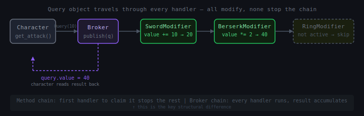
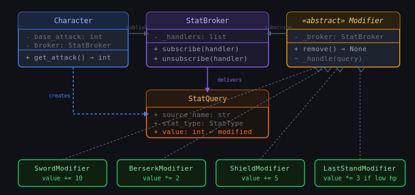

# Chain of Responsibility: Broker Chain

## 1. What problem are we trying to solve?

You're building a game. Characters can attack, defend, and use items. Stats like attack power and defense rating start at base values, but many things can modify them:

- A sword adds +10 attack
- A shield adds +5 defense
- A poison debuff halves attack
- A "berserk" buff doubles attack but sets defense to zero
- A magic ring adds +3 to all stats
- A skill called "Last Stand" boosts defense when health is below 20%

Now a character queries their current attack power. What is it?

```python
def get_attack(self):
    attack = self.base_attack
    if self.has_sword:
        attack += 10
    if self.is_poisoned:
        attack //= 2
    if self.is_berserk:
        attack *= 2
    if self.has_magic_ring:
        attack += 3
    # ... and every future modifier goes here too
```

This works until it doesn't. Every new item, buff, debuff, skill, or environmental effect means editing `get_attack`. The character class becomes a dumping ground for every game mechanic that has ever touched a stat. After twenty modifiers the method is unmaintainable, untestable, and fragile.

The deeper problem:

> We want to compute a value by passing it through a dynamic, composable set of modifiers — where modifiers can be added, removed, or reordered at runtime without the object that owns the value knowing anything about them.

That is the problem the **Broker Chain** solves.

---

## 2. Concept introduction

The **Broker Chain** is a variation of Chain of Responsibility where instead of routing a request to *one* handler that handles it and stops, *every* handler in the chain gets to inspect and modify a shared query object — and the final result is the accumulated product of all those modifications.

In plain English:

> A query object travels through every modifier in the chain. Each modifier can change the value. At the end, you read the result back from the query object.

Three things make it different from the method chain variant:

```text
Method chain:   one handler claims the request, the rest never see it
Broker chain:   every handler sees the request and can modify it

Method chain:   handlers are wired directly to each other
Broker chain:   handlers are registered with a central broker

Method chain:   the chain is fixed at wiring time
Broker chain:   handlers can be added and removed at runtime
```

The word "broker" refers to the central event bus that sits between the thing asking for a value and the things that can modify it. The asker fires an event. The broker delivers it to every registered handler. The handlers modify it. The asker reads the result.



---

## 3. The core structure

There are three parts:

```text
Query       — a mutable object carrying the value being computed
Broker      — an event bus that handlers register with and unregister from
Modifier    — a handler that subscribes to the broker and modifies queries
```

The flow is:

```text
Character asks: "what is my current attack?"
  → creates a Query(value=base_attack)
  → fires it through the Broker
    → Modifier A sees it, adds 10
    → Modifier B sees it, multiplies by 2
    → Modifier C sees it, subtracts 3
  → Character reads query.value
```

The character never knows which modifiers exist. The modifiers never know about each other. The broker coordinates without coupling anyone to anyone else.



---

## 4. The Query object

The query object is a small mutable container. It carries the value being computed and enough context for modifiers to make decisions.

```python
from enum import Enum, auto


class StatType(Enum):
    ATTACK = auto()
    DEFENSE = auto()
    SPEED = auto()


class StatQuery:
    def __init__(self, source_name: str, stat_type: StatType, base_value: int):
        self.source_name = source_name   # who is asking
        self.stat_type = stat_type       # which stat
        self.value = base_value          # starts at base, modifiers change it
```

The query is not a command — it carries data and gets passed around. Modifiers read from it and write back to `value`. At the end, `value` holds the final computed result.

---

## 5. The Broker

The broker is an event bus. Handlers register callbacks with it and can unregister them when they're no longer active.

```python
class StatBroker:
    def __init__(self):
        self._handlers: list[callable] = []

    def subscribe(self, handler: callable) -> None:
        self._handlers.append(handler)

    def unsubscribe(self, handler: callable) -> None:
        self._handlers.remove(handler)

    def publish(self, query: StatQuery) -> None:
        for handler in self._handlers:
            handler(query)
```

The broker doesn't know what kind of thing is subscribing. It doesn't know what queries contain. It only knows how to deliver a query to everyone who asked to receive it.

---

## 6. The Character

The character holds base stats and a reference to the broker. When asked for a computed stat, it creates a query, fires it through the broker, and reads the result back.

```python
class Character:
    def __init__(self, name: str, broker: StatBroker):
        self.name = name
        self._broker = broker
        self.base_attack = 10
        self.base_defense = 5
        self.health = 100
        self.max_health = 100

    def get_attack(self) -> int:
        query = StatQuery(self.name, StatType.ATTACK, self.base_attack)
        self._broker.publish(query)
        return query.value

    def get_defense(self) -> int:
        query = StatQuery(self.name, StatType.DEFENSE, self.base_defense)
        self._broker.publish(query)
        return query.value

    def __str__(self):
        return (
            f"{self.name}: "
            f"ATK={self.get_attack()} "
            f"DEF={self.get_defense()} "
            f"HP={self.health}/{self.max_health}"
        )
```

The character has zero knowledge of which modifiers exist. New modifiers can be registered with the broker without touching `Character` at all.

---

## 7. Modifiers

Each modifier subscribes to the broker and modifies queries that match its conditions.

```python
class Modifier:
    """Base class for all stat modifiers."""

    def __init__(self, broker: StatBroker):
        self._broker = broker
        broker.subscribe(self._handle)

    def _handle(self, query: StatQuery) -> None:
        raise NotImplementedError

    def remove(self) -> None:
        self._broker.unsubscribe(self._handle)
```

Concrete modifiers:

```python
class SwordModifier(Modifier):
    """Adds +10 attack — a sword."""

    def __init__(self, character_name: str, broker: StatBroker):
        self._character_name = character_name
        super().__init__(broker)

    def _handle(self, query: StatQuery) -> None:
        if (query.source_name == self._character_name
                and query.stat_type == StatType.ATTACK):
            query.value += 10


class ShieldModifier(Modifier):
    """Adds +5 defense — a shield."""

    def __init__(self, character_name: str, broker: StatBroker):
        self._character_name = character_name
        super().__init__(broker)

    def _handle(self, query: StatQuery) -> None:
        if (query.source_name == self._character_name
                and query.stat_type == StatType.DEFENSE):
            query.value += 5


class BerserkModifier(Modifier):
    """Doubles attack but sets defense to zero."""

    def __init__(self, character_name: str, broker: StatBroker):
        self._character_name = character_name
        super().__init__(broker)

    def _handle(self, query: StatQuery) -> None:
        if query.source_name != self._character_name:
            return
        if query.stat_type == StatType.ATTACK:
            query.value *= 2
        elif query.stat_type == StatType.DEFENSE:
            query.value = 0


class LastStandModifier(Modifier):
    """Triples defense when health is below 25%."""

    def __init__(self, character: "Character", broker: StatBroker):
        self._character = character
        super().__init__(broker)

    def _handle(self, query: StatQuery) -> None:
        if (query.source_name == self._character.name
                and query.stat_type == StatType.DEFENSE
                and self._character.health < self._character.max_health * 0.25):
            query.value *= 3
```

Each modifier is small, focused, and knows nothing about the others.

---

## 8. Putting it together

```python
broker = StatBroker()
hero = Character("Hero", broker)

print("=== No modifiers ===")
print(hero)

sword = SwordModifier("Hero", broker)
print("\n=== With sword ===")
print(hero)

shield = ShieldModifier("Hero", broker)
print("\n=== With sword + shield ===")
print(hero)

berserk = BerserkModifier("Hero", broker)
print("\n=== Berserk (sword + berserk) ===")
print(hero)

berserk.remove()
print("\n=== Berserk wore off ===")
print(hero)

last_stand = LastStandModifier(hero, broker)
hero.health = 20
print("\n=== Last Stand (health < 25%) ===")
print(hero)

hero.health = 80
print("\n=== Last Stand (health restored, inactive) ===")
print(hero)
```

Output:

```text
=== No modifiers ===
Hero: ATK=10 DEF=5 HP=100/100

=== With sword ===
Hero: ATK=20 DEF=5 HP=100/100

=== With sword + shield ===
Hero: ATK=20 DEF=10 HP=100/100

=== Berserk (sword + berserk) ===
Hero: ATK=40 DEF=0 HP=100/100

=== Berserk wore off ===
Hero: ATK=20 DEF=10 HP=100/100

=== Last Stand (health < 25%) ===
Hero: ATK=20 DEF=30 HP=20/100

=== Last Stand (health restored, inactive) ===
Hero: ATK=20 DEF=10 HP=80/100
```

Notice several things: `berserk.remove()` unregisters the modifier and it's gone immediately. `LastStandModifier` checks health at query time — it's reactive to live state, not state at registration time. The `Character` class was never touched.

---

## 9. Using context managers for scoped modifiers

A very clean Python idiom is to make temporary modifiers context managers. The modifier activates on `__enter__` and removes itself on `__exit__`:

```python
class ScopedModifier(Modifier):
    def __enter__(self):
        return self

    def __exit__(self, exc_type, exc_val, exc_tb):
        self.remove()
        return False
```

Then:

```python
broker = StatBroker()
hero = Character("Hero", broker)

print(hero)  # ATK=10 DEF=5

with SwordModifier("Hero", broker):
    print(hero)  # ATK=20 DEF=5
    with BerserkModifier("Hero", broker):
        print(hero)  # ATK=40 DEF=0
    print(hero)  # ATK=20 DEF=5 — berserk gone

print(hero)  # ATK=10 DEF=5 — sword gone
```

This is elegant for temporary effects like turn-based buffs, test scenarios, or request-scoped middleware — the modifier is guaranteed to clean itself up.

---

## 10. Natural example: a pricing engine

The same pattern appears naturally in a pricing engine. A base price needs to travel through a set of rules — discounts, surcharges, promotions, taxes — and the set of active rules changes per customer, per season, and per product category.

```python
from enum import Enum, auto
from dataclasses import dataclass


class PriceQueryType(Enum):
    UNIT_PRICE = auto()
    SHIPPING = auto()


@dataclass
class PriceQuery:
    customer_id: str
    product_sku: str
    query_type: PriceQueryType
    value: float
    quantity: int = 1


class PricingBroker:
    def __init__(self):
        self._handlers: list[callable] = []

    def subscribe(self, handler: callable) -> None:
        self._handlers.append(handler)

    def unsubscribe(self, handler: callable) -> None:
        self._handlers.remove(handler)

    def publish(self, query: PriceQuery) -> None:
        for handler in self._handlers:
            handler(query)


class BulkDiscountRule:
    """10% off when buying 10 or more units."""

    def __init__(self, broker: PricingBroker):
        self._broker = broker
        broker.subscribe(self._handle)

    def _handle(self, query: PriceQuery) -> None:
        if (query.query_type == PriceQueryType.UNIT_PRICE
                and query.quantity >= 10):
            query.value *= 0.90

    def remove(self) -> None:
        self._broker.unsubscribe(self._handle)


class VipDiscountRule:
    """15% off for VIP customers."""

    VIP_CUSTOMERS = {"cust-001", "cust-007"}

    def __init__(self, broker: PricingBroker):
        self._broker = broker
        broker.subscribe(self._handle)

    def _handle(self, query: PriceQuery) -> None:
        if (query.query_type == PriceQueryType.UNIT_PRICE
                and query.customer_id in self.VIP_CUSTOMERS):
            query.value *= 0.85

    def remove(self) -> None:
        self._broker.unsubscribe(self._handle)


class FreeShippingRule:
    """Free shipping when order total exceeds $100."""

    def __init__(self, broker: PricingBroker, order_total: float):
        self._broker = broker
        self._order_total = order_total
        broker.subscribe(self._handle)

    def _handle(self, query: PriceQuery) -> None:
        if (query.query_type == PriceQueryType.SHIPPING
                and self._order_total > 100):
            query.value = 0.0

    def remove(self) -> None:
        self._broker.unsubscribe(self._handle)


class PriceCalculator:
    def __init__(self, broker: PricingBroker):
        self._broker = broker

    def unit_price(
        self, customer_id: str, sku: str, base_price: float, quantity: int
    ) -> float:
        query = PriceQuery(
            customer_id=customer_id,
            product_sku=sku,
            query_type=PriceQueryType.UNIT_PRICE,
            value=base_price,
            quantity=quantity,
        )
        self._broker.publish(query)
        return query.value

    def shipping(
        self, customer_id: str, sku: str, base_shipping: float, order_total: float
    ) -> float:
        query = PriceQuery(
            customer_id=customer_id,
            product_sku=sku,
            query_type=PriceQueryType.SHIPPING,
            value=base_shipping,
            quantity=1,
        )
        self._broker.publish(query)
        return query.value
```

Usage:

```python
broker = PricingBroker()
calc = PriceCalculator(broker)

bulk = BulkDiscountRule(broker)
vip = VipDiscountRule(broker)
free_shipping = FreeShippingRule(broker, order_total=150)

price = calc.unit_price("cust-999", "WGT-001", base_price=20.0, quantity=2)
print(f"Regular, qty 2:  ${price:.2f}")     # $20.00

price = calc.unit_price("cust-999", "WGT-001", base_price=20.0, quantity=15)
print(f"Regular, qty 15: ${price:.2f}")     # $18.00

price = calc.unit_price("cust-001", "WGT-001", base_price=20.0, quantity=2)
print(f"VIP, qty 2:      ${price:.2f}")     # $17.00

price = calc.unit_price("cust-001", "WGT-001", base_price=20.0, quantity=15)
print(f"VIP, qty 15:     ${price:.2f}")     # $15.30

shipping = calc.shipping("cust-999", "WGT-001", base_shipping=9.99, order_total=150)
print(f"Shipping:        ${shipping:.2f}")  # $0.00
```

To run a Black Friday promotion, register one more rule. To end it, call `.remove()`. The `PriceCalculator` never changes.

---

## 11. Connection to earlier learned concepts and SOLID

**Open/Closed Principle** is where the Broker Chain shines most. Adding a new modifier means writing a new class and registering it. The `Character` class, the `PriceCalculator`, and all existing modifiers are untouched. This is OCP at runtime — the system is genuinely open to extension without a single line of existing code changing.

**Single Responsibility Principle**: each modifier has one job. `BerserkModifier` handles berserk. `LastStandModifier` handles Last Stand. The `Character` class handles being a character. None of them bleed into each other.

**Dependency Inversion**: the `Character` depends on the `StatBroker` abstraction. It never knows about `BerserkModifier` or `SwordModifier`. Modifiers depend on the broker too. No one depends on anyone else concretely — they all meet through the broker's publish/subscribe contract.

**Connection to Observer**: the Broker Chain is essentially Observer with a twist. In plain Observer, subscribers are notified of events and react to them. In the Broker Chain, subscribers receive a mutable query object and are expected to *modify* it. Observer says "something happened." Broker Chain says "compute this value — everyone contribute."

**Connection to CQS**: the query object travels through the chain as a command (it gets modified) but represents a query at the system level (the caller is asking for a computed value). This is one of the few places where the distinction gets subtle — the query object is mutable, but the pattern as a whole is serving a read operation. The key is that the broker chain result is never stored back onto the character; it's computed fresh each time it's asked for.

**Connection to Method Chain**: the method chain routes a request to one handler and stops. The broker chain delivers a query to every handler and collects the cumulative result. Use the method chain when you want the first handler that can deal with something to deal with it. Use the broker chain when you want every applicable handler to contribute to a result.

| Aspect | Method Chain | Broker Chain |
|---|---|---|
| How many handlers act? | One (the first that claims it) | All registered handlers |
| Can stop early? | Yes — return a response | No — all handlers always run |
| Handler wiring | Handlers reference each other | Handlers register with a broker |
| Dynamic at runtime? | Rewiring is possible but awkward | Natural — subscribe/unsubscribe |
| Result | One handler produces it | Accumulated through all handlers |

---

## 12. Example from a popular Python package

**pytest's plugin system** is a clean real-world example. pytest has a central `PluginManager` (the broker). Plugins register hooks (subscribe). When pytest needs to compute something — which tests to collect, how to format a failure, whether to skip a test — it fires a hook call through the plugin manager. Every registered plugin that implements that hook gets called, and the results are accumulated.

For example, the `pytest_collection_modifyitems` hook lets every registered plugin inspect and reorder the list of collected test items. Plugin A might sort by name. Plugin B might move slow tests to the end. Plugin C might filter out tests marked with a certain tag. All three run on the same list, each modifying it in turn — exactly the broker chain pattern.

```python
# in a pytest plugin
def pytest_collection_modifyitems(config, items):
    # items is the mutable query object
    # this plugin moves slow tests to the end
    slow = [i for i in items if i.get_closest_marker("slow")]
    fast = [i for i in items if not i.get_closest_marker("slow")]
    items[:] = fast + slow
```

Every plugin that defines this hook receives the same `items` list and can modify it. pytest collects all the modifications. The test runner never knows which plugins exist — it just fires the hook through the plugin manager and uses whatever comes back.

Similarly, **scikit-learn pipelines with custom transformers** follow the same idea: each transformer in a pipeline receives the data array, modifies it, and passes the result on. The pipeline is the broker; the transformers are the handlers; the data array is the mutable query.

---

## 13. When to use and when not to use

Use the Broker Chain when:

| Situation | Why Broker Chain helps |
|---|---|
| Multiple independent rules contribute to one computed value | Each rule is a separate modifier |
| Rules need to be added or removed at runtime | Subscribe/unsubscribe makes this trivial |
| Rules should be ignorant of each other | The broker decouples them completely |
| The set of rules changes per context | Register different modifiers for different situations |
| You want temporary, scoped modifications | Context managers make this clean |

Good fits: game stat systems, pricing engines, permission systems, rendering pipelines, plugin architectures, rule engines, feature flag systems.

Avoid it when:

- Only one handler should act — use the method chain instead.
- The modification order doesn't matter and won't change — a simple list of functions is clearer and faster.
- The number of modifiers is very small and fixed — the indirection of a broker adds complexity without benefit.
- Debugging modifier interaction is critical — a chain of arbitrary modifications to a shared object can be hard to trace when things go wrong. Log inside each modifier if you need to diagnose this.
- Performance is critical in a tight loop — every query fires through every registered handler; for high-frequency queries, benchmark before committing.

---

## 14. Practical rule of thumb

Ask:

> Do I have a value that needs to be computed by combining the effects of multiple independent, dynamic contributors?

If yes, the Broker Chain is likely the right tool.

Ask:

> Should the first contributor that handles a case prevent the others from acting?

If yes, use the method chain instead.

Ask:

> Do contributors need to be added and removed at runtime, independently of the object being queried?

If yes, the broker's subscribe/unsubscribe mechanism is exactly what you need.

The clearest signal: if you find yourself writing a method full of `if has_X: value += ...; if has_Y: value *= ...; if has_Z: value = ...` that keeps growing every time a new game mechanic or business rule is added — that is the smell. Each condition is a modifier waiting to be extracted, and a broker is waiting to coordinate them.

---

## 15. Summary and mental model

The Broker Chain decouples the thing asking for a computed value from the things that contribute to that value. A mutable query object travels through every registered handler. Each handler modifies it if applicable. The final value is the accumulated result.

```text
Creator registers modifiers with Broker
Asker creates Query(base_value)
Broker delivers Query to all registered modifiers
  → Modifier A: query.value += 10
  → Modifier B: query.value *= 2
  → Modifier C: if condition: query.value = 0
Asker reads query.value  ← final computed result
```

Mental model — think of a **tax form**:

```text
You start with your gross income (base value).
The form passes through several sections:
  deductions section   → subtracts something
  credits section      → subtracts something else
  surcharge section    → adds something back
  bracket section      → applies a rate
Each section modifies the running total.
At the end you read the final amount owed.
No section knows what the others did.
The form is the query. The sections are the modifiers.
```

| Pattern | How many handlers act | Handlers know each other? | Dynamic at runtime? |
|---|---|---|---|
| Method Chain | One (first to claim) | Only via `_next` | Awkward |
| Broker Chain | All registered | Never | Natural |

In one sentence:

> Use the Broker Chain when a value must be computed by passing it through a set of independent, dynamically registered modifiers — so that contributors can be added, removed, and reordered without the querying object ever knowing they exist.

---

[Method Chain](chain_of_responsibility_method_chain.md) · [Command Query Separation](chain_of_responsibility_cqs.md)
