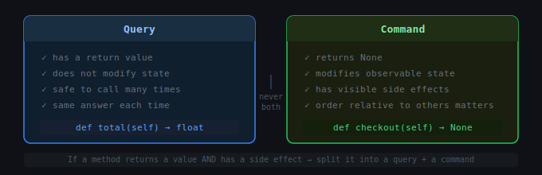
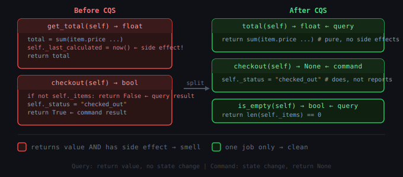

# Chain of Responsibility: Command Query Separation

## 1. What problem are we trying to solve?

Here's a method that looks innocent:

```python
def get_next_order(self) -> Order:
    order = self._queue.pop(0)
    self._processed_count += 1
    self._last_accessed = datetime.now()
    return order
```

You called it `get_next_order`. It sounds like a read. But it also removes an item from the queue, increments a counter, and updates a timestamp. Four things happen when you expected one.

Now consider this:

```python
report = generate_report(user_id)
```

Did generating the report send an email? Mark the report as "viewed"? Deduct a credit from the user's account? Log an analytics event? You can't tell from the name. You have to read the implementation — and hope it doesn't change.

This kind of hidden side-effect creates real problems:

```python
# safe to call twice? who knows
total_1 = calculate_invoice_total(invoice)
total_2 = calculate_invoice_total(invoice)
```

```python
# these look the same but maybe aren't
count = len(self.pending_orders)
count = self.get_pending_order_count()  # does this remove them?
```

```python
# debugging: you read a value, but reading changed state
print(f"Queue size: {queue.size()}")   # did this pop something?
```

The problem isn't the individual methods. The problem is that when a method can both *return information* and *change state*, you can never be sure what you're doing. Reading becomes dangerous. Everything requires careful study.

That's the problem **Command Query Separation** is designed to solve.

---

## 2. Concept introduction

**Command Query Separation (CQS)** is a design principle that says:

> Every method should either *change state* or *return information*, but never both at the same time.

The two kinds of methods are:

**Query** — asks a question. Returns a value. Changes nothing. Safe to call zero, one, or a hundred times — the answer is the same and the world is unchanged.

**Command** — does something. Changes state. Returns nothing (or at most a simple acknowledgment). Calling it has an observable effect.

In plain English:

> If you're asking, you shouldn't be touching anything. If you're doing, you don't need to report back.

This isn't a design pattern in the GoF sense. It's a **principle** — a rule for how to design method signatures. It sits at the same level as SRP or DIP: you apply it everywhere, all the time, and it quietly prevents a whole class of bugs and confusion.



---

## 3. The two kinds of methods

A **query** looks like this:

```python
def total_price(self) -> float:
    return sum(item.price for item in self._items)

def is_empty(self) -> bool:
    return len(self._items) == 0

def find_by_id(self, order_id: str) -> Order | None:
    return self._orders.get(order_id)
```

Properties of a query:

```text
has a return value
does not modify self or anything else
safe to call multiple times — same result each time
can be called in any order relative to other queries
```

A **command** looks like this:

```python
def add_item(self, item: Item) -> None:
    self._items.append(item)

def submit(self) -> None:
    self._status = "submitted"
    self._submitted_at = datetime.now()

def cancel(self, reason: str) -> None:
    self._status = "cancelled"
    self._cancellation_reason = reason
```

Properties of a command:

```text
returns None (or possibly a simple acknowledgment like a new ID)
modifies state
has observable effects
order relative to other commands usually matters
```

The discipline of CQS is keeping these two categories separate.

---

## 4. A concrete before-and-after

### Before CQS

```python
class ShoppingCart:
    def __init__(self):
        self._items = []
        self._discount_applied = False

    def add_item(self, item):
        self._items.append(item)
        if len(self._items) >= 5 and not self._discount_applied:
            self._discount_applied = True   # side effect hidden in a simple method
        return len(self._items)             # returns state after mutation

    def get_total(self):
        total = sum(item.price for item in self._items)
        if self._discount_applied:
            total *= 0.9
        self._last_calculated = datetime.now()  # side effect hidden in a query!
        return total

    def checkout(self):
        if not self._items:
            return False                    # returns data AND has side effects
        self._status = "checked_out"
        self._items.clear()
        return True
```

Every method is doing double duty. `add_item` mutates and reports. `get_total` reads and writes. `checkout` commands and queries at the same time. None of these are safe to call casually.

### After CQS

```python
from dataclasses import dataclass
from datetime import datetime


@dataclass
class Item:
    name: str
    price: float


class ShoppingCart:
    def __init__(self):
        self._items: list[Item] = []
        self._discount_applied: bool = False
        self._status: str = "open"

    # --- Queries ---

    def item_count(self) -> int:
        return len(self._items)

    def is_empty(self) -> bool:
        return len(self._items) == 0

    def has_discount(self) -> bool:
        return self._discount_applied

    def total(self) -> float:
        subtotal = sum(item.price for item in self._items)
        return subtotal * 0.9 if self._discount_applied else subtotal

    def status(self) -> str:
        return self._status

    # --- Commands ---

    def add_item(self, item: Item) -> None:
        if self._status != "open":
            raise ValueError("Cannot add items to a checked-out cart")
        self._items.append(item)

    def apply_discount(self) -> None:
        self._discount_applied = True

    def checkout(self) -> None:
        if self._status != "open":
            raise ValueError("Cart is already checked out")
        if not self._items:
            raise ValueError("Cannot check out an empty cart")
        self._status = "checked_out"
```



Now the contract is clear for every method:

```python
cart = ShoppingCart()
cart.add_item(Item("Widget", 10.0))
cart.add_item(Item("Gadget", 25.0))

# queries are safe to call any number of times, in any order
print(cart.item_count())  # 2
print(cart.total())       # 35.0
print(cart.total())       # 35.0 — identical, no surprise

if cart.item_count() >= 5:
    cart.apply_discount()  # command

cart.checkout()            # command

print(cart.status())       # "checked_out" — query
```

The caller never has to wonder: does calling `total()` change something?

---

## 5. Why queries must be pure

A query must not change observable state. This is what makes queries safe.

"Observable state" means anything the caller or another part of the program can detect. Caching is fine:

```python
def total(self) -> float:
    if self._cached_total is None:
        self._cached_total = sum(item.price for item in self._items)
    return self._cached_total
```

This technically writes to `self._cached_total`, but it's an internal optimization detail. From the caller's perspective, calling `total()` once or ten times returns the same answer and changes nothing they can observe. That counts as a pure query.

But this is not a pure query:

```python
def total(self) -> float:
    self._access_log.append(datetime.now())  # observable side effect
    return sum(item.price for item in self._items)
```

The access log is externally visible state. Calling `total()` twice produces a different access log than calling it once. That is a side effect hidden in a query — the exact problem CQS prevents.

If you genuinely need to log access, make it a separate command:

```python
def total(self) -> float:
    return sum(item.price for item in self._items)

def record_access(self) -> None:
    self._access_log.append(datetime.now())
```

---

## 6. Natural example: an inventory system

An inventory system is a natural place to see CQS pay off.

```python
from dataclasses import dataclass


@dataclass
class Product:
    sku: str
    name: str
    price: float


class Inventory:
    def __init__(self):
        self._stock: dict[str, int] = {}
        self._reserved: dict[str, int] = {}
        self._products: dict[str, Product] = {}

    # --- Commands ---

    def register_product(self, product: Product, initial_stock: int) -> None:
        self._products[product.sku] = product
        self._stock[product.sku] = initial_stock
        self._reserved[product.sku] = 0

    def restock(self, sku: str, quantity: int) -> None:
        if sku not in self._stock:
            raise KeyError(f"Unknown SKU: {sku}")
        if quantity <= 0:
            raise ValueError("Restock quantity must be positive")
        self._stock[sku] += quantity

    def reserve(self, sku: str, quantity: int) -> None:
        if self.available(sku) < quantity:
            raise ValueError(f"Insufficient stock for {sku}")
        self._reserved[sku] += quantity

    def fulfill(self, sku: str, quantity: int) -> None:
        if self._reserved.get(sku, 0) < quantity:
            raise ValueError(f"Cannot fulfill more than reserved for {sku}")
        self._reserved[sku] -= quantity
        self._stock[sku] -= quantity

    def release_reservation(self, sku: str, quantity: int) -> None:
        self._reserved[sku] -= quantity

    # --- Queries ---

    def available(self, sku: str) -> int:
        return self._stock.get(sku, 0) - self._reserved.get(sku, 0)

    def on_hand(self, sku: str) -> int:
        return self._stock.get(sku, 0)

    def reserved(self, sku: str) -> int:
        return self._reserved.get(sku, 0)

    def is_available(self, sku: str, quantity: int) -> bool:
        return self.available(sku) >= quantity

    def low_stock_skus(self, threshold: int = 5) -> list[str]:
        return [
            sku for sku, qty in self._stock.items()
            if qty - self._reserved.get(sku, 0) <= threshold
        ]

    def product(self, sku: str) -> Product | None:
        return self._products.get(sku)
```

Usage:

```python
inventory = Inventory()
inventory.register_product(Product("WGT-001", "Widget", 9.99), initial_stock=100)
inventory.register_product(Product("GDG-002", "Gadget", 24.99), initial_stock=8)

# queries tell you about the world
print(inventory.available("WGT-001"))        # 100
print(inventory.is_available("WGT-001", 5))  # True
print(inventory.low_stock_skus())            # ['GDG-002']

# commands change the world
inventory.reserve("WGT-001", 10)
inventory.reserve("GDG-002", 5)

# queries still just tell you things
print(inventory.available("WGT-001"))   # 90
print(inventory.reserved("WGT-001"))    # 10
print(inventory.low_stock_skus())       # ['GDG-002']

# fulfill the orders (commands)
inventory.fulfill("WGT-001", 10)
inventory.fulfill("GDG-002", 5)

print(inventory.on_hand("WGT-001"))     # 90
```

Notice how the usage reads. Queries answer questions. Commands do work. No method does both.

---

## 7. The hard case: what about pop()?

CQS is a principle, not a law. The canonical hard case is a stack or queue.

A `pop()` operation does two things by nature: it removes an element and returns it. If you split it:

```python
def peek(self) -> int:       # query: look at top
    return self._stack[-1]

def pop(self) -> None:       # command: remove top
    self._stack.pop()
```

Now using the stack requires two calls, and in concurrent code, another thread could change the stack between them. The combined `pop()` is atomic; the split version is not.

This is the classic exception to CQS. When atomicity matters, it is acceptable to have a method that returns a value and changes state together. Python's `dict.pop()`, `list.pop()`, and `queue.Queue.get()` all do this deliberately.

The lesson is not "CQS is wrong." It is:

> Apply CQS by default. Break it only when atomicity or practicality genuinely requires it — and when you break it, do so deliberately and with a clear reason.

Most methods in most business code don't have this problem. The `pop()` exception doesn't justify hiding side effects inside every getter.

---

## 8. Connection to earlier learned concepts and SOLID

**Single Responsibility Principle** and CQS are close relatives. SRP says a class should have one reason to change. CQS says a method should have one kind of contract: either change state or return information. Both are about clarity of purpose at different levels of granularity — class vs. method.

**Open/Closed Principle**: when queries and commands are separated, you can add new queries without worrying about accidentally introducing side effects into existing reads. New commands can be added without affecting the contract of existing queries.

**Dependency Inversion**: once methods are cleanly separated, it becomes much easier to define narrow interfaces. An interface that only reads:

```python
class InventoryReader(ABC):
    def available(self, sku: str) -> int: ...
    def is_available(self, sku: str, quantity: int) -> bool: ...
```

and an interface that only writes:

```python
class InventoryWriter(ABC):
    def reserve(self, sku: str, quantity: int) -> None: ...
    def fulfill(self, sku: str, quantity: int) -> None: ...
```

This is CQS enabling **Interface Segregation** — read-only components depend on read-only interfaces, write-only components depend on write-only interfaces.

**Connection to Builder**: a Builder is a chain of commands (`with_name(...)`, `with_email(...)`) followed by one query (`build()`). CQS is what makes the Builder pattern feel right — the setters return `self` (or nothing), and `build()` is the one moment you ask for information.

**Connection to Factory**: factory methods are pure queries — they return a new object and ideally change nothing about the factory itself. CQS is why it feels wrong when a factory has global side effects.

**Connection to Chain of Responsibility**: each handler in a chain is essentially performing a command (modifying request state) or producing a query result (the response). A well-designed chain keeps those roles clear — handlers that check conditions are query-like, handlers that do work are command-like.

---

## 9. Example from a popular Python package

**pandas** is a good illustration because it largely follows CQS and breaks it in one famous place.

Queries in pandas return new objects and change nothing:

```python
import pandas as pd

df = pd.DataFrame({"a": [1, 2, 3], "b": [4, 5, 6]})

# all queries — df is unchanged after each call
df.head()
df.describe()
df.groupby("a").sum()
df.sort_values("b")
df.filter(items=["a"])
```

Commands mutate in place:

```python
df.drop(columns=["b"], inplace=True)
df.reset_index(inplace=True)
df.rename(columns={"a": "x"}, inplace=True)
```

The famous CQS tension in pandas is the `inplace=True` parameter. Methods like `sort_values`, `drop`, and `rename` accept `inplace=True`, turning what looks like a query into a command depending on a runtime flag. This has been widely criticized in the pandas community — it blurs the query/command distinction, makes code harder to reason about, and provides essentially no performance benefit. The pandas team now recommends against `inplace=True` and may deprecate it.

That criticism is CQS in action: when the same method is sometimes a query and sometimes a command depending on a flag, the resulting confusion is exactly the problem CQS is designed to prevent.

---

## 10. When to apply CQS and when not to

CQS applies almost everywhere in ordinary business code. Treat it as the default rule, not a special technique to pull out for complex cases.

Apply it when:

```text
designing class interfaces
writing methods on domain objects
building service layers
designing repositories and data access
writing utility helpers
```

The cases where it is reasonable to break it:

```text
stack pop() / queue get() — atomicity matters in concurrent contexts
test helpers — sometimes a teardown method resets and returns state
language idioms — Python list.pop(), dict.setdefault() are deliberate
generators and iterators — advancing state and returning a value is the whole point
```

Even in these cases, the exception should be intentional and documented, not accidental.

A common pragmatic exception is returning the new ID from a save operation:

```python
def save(self, entity) -> int:    # returns the new ID
    ...
```

This is arguably fine because the ID is a direct consequence of the command, not pre-existing observable state being read. But be aware you're making an exception, and keep it narrow.

---

## 11. Practical rule of thumb

Before writing any method, ask:

> Am I asking a question or doing something?

If **asking**: make sure there's no state change anywhere in the method body — not even a seemingly harmless one. Return the answer.

If **doing**: make sure the return type is `None`. If the caller needs to know something after the command, they can call a query.

The simplest mechanical check:

```text
method has a return value (other than None) → it must be a query
method returns None                         → it must be a command
```

If a method returns a value and has a side effect, that is a smell. Split it:

```python
# smell — does two things
def pop_and_notify(self) -> Item:
    item = self._queue.pop(0)
    self._notify_observers()      # side effect hidden in a "getter"
    return item

# better — one job each
def peek(self) -> Item:
    return self._queue[0]

def pop(self) -> None:
    item = self._queue.pop(0)
    self._notify_observers()
```

---

## 12. Summary and mental model

Command Query Separation divides every method into one of two categories with no overlap:

```text
Query   → asks, does not touch  → has a return value
Command → does, does not report → returns None
```

Mental model — think of a **reference book and an action form**:

```text
Query   = consulting a reference book
          you look up information
          the book is unchanged after you read it
          you can read the same page a hundred times

Command = filling out and submitting an action form
          you cause something to change
          you don't get the book back altered
          you might get a receipt (the new ID, an acknowledgment)
          but you never read and change at the same time
```

The value is not complexity reduction in any single method. The value is the **guarantee** it creates across your entire codebase: when you see a method that returns something, you know it changes nothing. When you see a void method, you know something happened. That predictability compounds — it makes the whole system easier to read, test, debug, and extend.

| Concept | Returns | Changes state |
|---|---|---|
| Query | Yes | Never |
| Command | No (or acknowledgment only) | Yes |
| `pop()` exception | Yes | Yes — justified by atomicity |

In one sentence:

> Command Query Separation means every method either asks a question without touching anything, or does something without reporting back — so that reading is always safe and doing is always obvious.

---

[Method Chain](chain_of_responsibility_method_chain.md) · [Broker Chain](chain_of_responsibility_broker.md)
