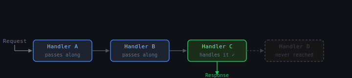
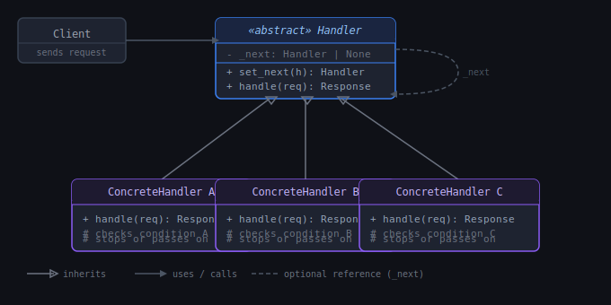

# Chain of Responsibility: Method Chain

## 1. What problem are we trying to solve?

Imagine you're building a web application. Every incoming HTTP request needs to go through several checks before reaching your actual business logic:

```python
def handle_request(request):
    if not auth_service.is_authenticated(request):
        return Response(401, "Unauthorized")

    if not auth_service.is_authorized(request):
        return Response(403, "Forbidden")

    if rate_limiter.is_exceeded(request):
        return Response(429, "Too Many Requests")

    errors = validator.validate(request)
    if errors:
        return Response(400, str(errors))

    return process_order(request)
```

This works. But look at what `handle_request` knows about:

```text
authentication logic
authorization logic
rate limiting logic
input validation logic
business logic
```

Five unrelated responsibilities jammed into one place. When you add logging, caching, or CORS headers, they pile on too. The function becomes a long, fragile vertical list of concerns.

Now imagine three different endpoints — checkout, profile update, admin panel — each needing a slightly different combination of those checks. Do you copy-paste the chain? Extract helper functions? Put it all in a base class?

The deeper problem is:

> We have a sequence of processing steps where each step can either handle the request itself, pass it along, or stop the chain entirely — but we want to compose that sequence flexibly without cramming everything into one place.

That is the problem the **Chain of Responsibility** pattern solves, and the **method chain** is its most direct form.

---

## 2. Concept introduction

The **Chain of Responsibility** pattern passes a request along a chain of handlers. Each handler decides independently whether to process the request, pass it to the next handler, or stop the chain.

In plain English:

> Line up a sequence of handlers. Give the request to the first one. Each one either deals with it, forwards it, or blocks it. The sender doesn't need to know which handler will ultimately do the work.

Chain of Responsibility is a **behavioral pattern** — it's about how objects communicate and how responsibility is assigned.

The **method chain** variant is the simplest and most explicit form: each handler holds a reference to the next handler, and you wire them together like links in a chain.



Each handler knows only two things:

- How to process its own concern.
- How to call the next handler.

Nothing else.

---

## 3. The core structure

The foundation is a handler interface with two responsibilities: do its own work, and know about the next handler.

```python
from __future__ import annotations
from abc import ABC, abstractmethod
from dataclasses import dataclass


@dataclass
class Request:
    user_id: int
    api_key: str
    body: dict
    calls_this_minute: int


@dataclass
class Response:
    status: int
    message: str


class Handler(ABC):
    def __init__(self):
        self._next: Handler | None = None

    def set_next(self, handler: Handler) -> Handler:
        self._next = handler
        return handler      # returning handler enables chaining set_next calls

    def handle(self, request: Request) -> Response | None:
        if self._next:
            return self._next.handle(request)
        return None         # end of chain, nothing handled it

    @abstractmethod
    def _do_handle(self, request: Request) -> Response | None:
        pass
```



There is a design choice buried in `handle`. Two common approaches:

**Pass-by-default**: the base `handle` always calls `_next` unless the subclass stops it explicitly. Subclasses override `_do_handle` and return a `Response` to short-circuit, or `None` to continue.

**Explicit pass**: subclasses call `super().handle(request)` themselves when they want to continue. Nothing happens automatically.

The pass-by-default approach is cleaner — each handler only needs to say when it *stops* the chain, not constantly remember to pass it along.

---

## 4. Concrete handlers

Each handler is a small, focused class with one job.

```python
class AuthenticationHandler(Handler):
    VALID_KEYS = {"secret-key-123", "secret-key-456"}

    def handle(self, request: Request) -> Response | None:
        result = self._do_handle(request)
        if result:
            return result
        return super().handle(request)

    def _do_handle(self, request: Request) -> Response | None:
        if request.api_key not in self.VALID_KEYS:
            print(f"[Auth] Rejected: invalid API key")
            return Response(401, "Unauthorized")
        print(f"[Auth] Passed")
        return None


class RateLimitHandler(Handler):
    MAX_CALLS = 10

    def handle(self, request: Request) -> Response | None:
        result = self._do_handle(request)
        if result:
            return result
        return super().handle(request)

    def _do_handle(self, request: Request) -> Response | None:
        if request.calls_this_minute > self.MAX_CALLS:
            print(f"[RateLimit] Rejected: {request.calls_this_minute} calls")
            return Response(429, "Too Many Requests")
        print(f"[RateLimit] Passed")
        return None


class ValidationHandler(Handler):
    def handle(self, request: Request) -> Response | None:
        result = self._do_handle(request)
        if result:
            return result
        return super().handle(request)

    def _do_handle(self, request: Request) -> Response | None:
        if "amount" not in request.body:
            print(f"[Validation] Rejected: missing 'amount'")
            return Response(400, "Missing required field: amount")
        if not isinstance(request.body["amount"], (int, float)):
            print(f"[Validation] Rejected: 'amount' must be a number")
            return Response(400, "Field 'amount' must be a number")
        print(f"[Validation] Passed")
        return None


class BusinessLogicHandler(Handler):
    def handle(self, request: Request) -> Response | None:
        return self._do_handle(request)

    def _do_handle(self, request: Request) -> Response | None:
        amount = request.body["amount"]
        print(f"[Business] Processing order for ${amount}")
        return Response(200, f"Order placed for ${amount}")
```

Each handler is completely unaware of the others. `AuthenticationHandler` doesn't know `RateLimitHandler` exists.

---

## 5. Wiring the chain

```python
auth = AuthenticationHandler()
rate_limit = RateLimitHandler()
validation = ValidationHandler()
business = BusinessLogicHandler()

auth.set_next(rate_limit).set_next(validation).set_next(business)
```

`set_next` returns the handler it receives, so the chain reads left to right. `auth` is the entry point.

```python
print("--- Valid request ---")
response = auth.handle(Request(
    user_id=1,
    api_key="secret-key-123",
    body={"amount": 49.99},
    calls_this_minute=3,
))
print(response)

print("\n--- Bad API key ---")
response = auth.handle(Request(
    user_id=2,
    api_key="wrong-key",
    body={"amount": 49.99},
    calls_this_minute=3,
))
print(response)

print("\n--- Rate limited ---")
response = auth.handle(Request(
    user_id=1,
    api_key="secret-key-123",
    body={"amount": 49.99},
    calls_this_minute=15,
))
print(response)

print("\n--- Missing amount ---")
response = auth.handle(Request(
    user_id=1,
    api_key="secret-key-123",
    body={},
    calls_this_minute=3,
))
print(response)
```

Output:

```text
--- Valid request ---
[Auth] Passed
[RateLimit] Passed
[Validation] Passed
[Business] Processing order for $49.99
Response(status=200, message='Order placed for $49.99')

--- Bad API key ---
[Auth] Rejected: invalid API key
Response(status=401, message='Unauthorized')

--- Rate limited ---
[Auth] Passed
[RateLimit] Rejected: 15 calls
Response(status=429, message='Too Many Requests')

--- Missing amount ---
[Auth] Passed
[RateLimit] Passed
[Validation] Rejected: missing 'amount'
Response(status=400, message="Missing required field: amount")
```

Each handler stops the chain when it needs to. Handlers that don't care about the request pass it silently along.

---

## 6. Natural example: expense approval

A very human example is an expense approval system. Companies have approval tiers: small expenses go to a team lead, medium ones to a manager, large ones to a director, anything above that to the CFO.

```python
from __future__ import annotations
from abc import ABC, abstractmethod
from dataclasses import dataclass


@dataclass
class ExpenseRequest:
    employee: str
    description: str
    amount: float


@dataclass
class ApprovalResult:
    approved: bool
    approved_by: str
    message: str


class Approver(ABC):
    def __init__(self, name: str, limit: float):
        self._name = name
        self._limit = limit
        self._next: Approver | None = None

    def set_next(self, approver: Approver) -> Approver:
        self._next = approver
        return approver

    def approve(self, request: ExpenseRequest) -> ApprovalResult:
        if request.amount <= self._limit:
            return self._handle(request)
        if self._next:
            print(f"[{self._name}] ${request.amount} exceeds my limit (${self._limit}), escalating...")
            return self._next.approve(request)
        return ApprovalResult(
            approved=False,
            approved_by="none",
            message=f"No approver has authority for ${request.amount}"
        )

    def _handle(self, request: ExpenseRequest) -> ApprovalResult:
        print(f"[{self._name}] Approving ${request.amount} for {request.employee}")
        return ApprovalResult(
            approved=True,
            approved_by=self._name,
            message=f"Approved by {self._name}"
        )


class TeamLead(Approver):
    def __init__(self): super().__init__("Team Lead", limit=500)

class Manager(Approver):
    def __init__(self): super().__init__("Manager", limit=5_000)

class Director(Approver):
    def __init__(self): super().__init__("Director", limit=50_000)

class CFO(Approver):
    def __init__(self): super().__init__("CFO", limit=float("inf"))
```

Wiring and usage:

```python
team_lead = TeamLead()
manager = Manager()
director = Director()
cfo = CFO()

team_lead.set_next(manager).set_next(director).set_next(cfo)

expenses = [
    ExpenseRequest("Alice", "Team lunch", 120),
    ExpenseRequest("Bob", "Conference ticket", 1_800),
    ExpenseRequest("Carol", "Server hardware", 22_000),
    ExpenseRequest("Dave", "Company acquisition", 500_000),
]

for expense in expenses:
    print(f"\n{expense.employee}: ${expense.amount} — {expense.description}")
    result = team_lead.approve(expense)
    print(f"→ {result.message}")
```

Output:

```text
Alice: $120 — Team lunch
[Team Lead] Approving $120 for Alice
→ Approved by Team Lead

Bob: $1800 — Conference ticket
[Team Lead] $1800 exceeds my limit ($500), escalating...
[Manager] Approving $1800 for Bob
→ Approved by Manager

Carol: $22000 — Server hardware
[Team Lead] $22000 exceeds my limit ($500), escalating...
[Manager] $22000 exceeds my limit ($5000), escalating...
[Director] Approving $22000 for Carol
→ Approved by Director

Dave: $500000 — Company acquisition
[Team Lead] $500000 exceeds my limit ($500), escalating...
[Manager] $500000 exceeds my limit ($5000), escalating...
[Director] $500000 exceeds my limit ($50000), escalating...
[CFO] Approving $500000 for Dave
→ Approved by CFO
```

This mirrors exactly how real organizations work. The structure is intuitive because the pattern emerged from the real-world practice of escalation.

---

## 7. Connection to earlier learned concepts and SOLID

**Single Responsibility Principle** is the strongest connection. Without Chain of Responsibility, one function or class handles everything. With it, each handler has exactly one concern: `AuthenticationHandler` authenticates, `RateLimitHandler` rate-limits. None of them bleeds into the others.

**Open/Closed Principle** applies naturally. Adding a new check — a `CORSHandler` or a `LoggingHandler` — means writing a new class and inserting it into the chain. None of the existing handlers need to change.

**Dependency Inversion** is also present. The entry point depends on the `Handler` abstraction, not on `AuthenticationHandler` or `RateLimitHandler` directly. You can swap or reorder the chain without touching business logic.

**Liskov Substitution** holds cleanly: every concrete handler is a valid `Handler`. You can put any handler anywhere in the chain and the chain still behaves correctly.

**Compare with Decorator**: Decorator and Chain of Responsibility look superficially similar — both involve a chain of objects. The distinction is intent:

| Aspect | Decorator | Chain of Responsibility |
|---|---|---|
| Purpose | Add behaviour *around* every call | Decide *who* handles a request |
| Can stop the chain? | Usually no — all layers run | Yes — any handler can short-circuit |
| All layers always execute? | Yes | No — stops at the handler that acts |
| Direction of control | Wraps inward, unwinds outward | Passes forward until handled |

A Decorator always adds to a call and lets it complete. A Chain handler may stop everything.

**Compare with Facade**: Facade hides *how* a subsystem works behind one simple entry point. Chain of Responsibility *is* the processing structure — the chain itself does the work, nothing is hidden behind it.

---

## 8. Example from a popular Python package

Django's middleware stack is a textbook Chain of Responsibility implementation.

When a request hits a Django application, it travels through a list of middleware classes before reaching the view function, and the response travels back through them on the way out:

```python
# settings.py
MIDDLEWARE = [
    "django.middleware.security.SecurityMiddleware",
    "django.contrib.sessions.middleware.SessionMiddleware",
    "django.middleware.common.CommonMiddleware",
    "django.middleware.csrf.CsrfViewMiddleware",
    "django.contrib.auth.middleware.AuthenticationMiddleware",
    "django.contrib.messages.middleware.MessageMiddleware",
]
```

Each middleware class implements `__call__`, does its own concern, and either returns a response itself — short-circuiting the chain on a CSRF failure, for example — or calls `self.get_response(request)` to pass along to the next middleware.

`CsrfViewMiddleware` inspects the CSRF token. If it's invalid, it returns `403 Forbidden` immediately — the request never reaches `AuthenticationMiddleware` or the view. If it's valid, it calls `get_response(request)` and the chain continues.

You add behaviour to the request/response cycle by adding a class to `MIDDLEWARE`. You remove it by removing the entry. No existing middleware changes. That is Chain of Responsibility enabling the Open/Closed Principle in a major production framework.

---

## 9. When to use and when not to use

Use Chain of Responsibility when:

| Situation | Why it helps |
|---|---|
| Multiple objects might handle a request, but you don't know which until runtime | The chain decides dynamically |
| You want to decouple the sender from the receiver | Sender only knows the first handler |
| Handlers should be composable in different orders for different contexts | Different chains for different endpoints |
| You're adding, removing, or reordering checks frequently | Change the wiring, not the handlers |
| Each processing step has a single, clear concern | One class per concern |

Good fits: middleware stacks, approval workflows, event processing pipelines, input validation pipelines, logging hierarchies, support ticket escalation.

Avoid it when:

- Every handler must run on every request — just call them sequentially in a list. The chain is for *conditional* routing, not guaranteed sequential execution.
- There are only two or three fixed steps that never change — a plain `if`/`elif` sequence is clearer and easier to follow.
- Debugging matters a lot — a long chain can be hard to trace when something goes wrong. A handler silently passing `None` down the chain until nothing handles the request is a subtle failure mode.
- The order of handlers matters subtly and changes often — wiring mistakes are silent and hard to catch.

---

## 10. Practical rule of thumb

Ask:

> Do I have a list of checks or steps where any one of them might stop the process, and I want each step in its own class?

If yes, Chain of Responsibility fits.

Ask:

> Is the set of steps fixed and always executed in the same order on the same object?

If yes, a simple sequence of method calls is probably clearer. Chain of Responsibility earns its keep when the *composition* of steps varies.

Ask:

> Will I need to insert, remove, or reorder steps as the system grows?

If yes, the chain's explicit wiring makes that easy without touching individual handlers.

The simplest practical test: if you find yourself writing a long `if`/`elif` sequence in one method that handles different concerns, and each branch is growing — that is the smell. Each concern belongs in its own handler, and a chain connects them.

---

## 11. Summary and mental model

Chain of Responsibility passes a request along a line of handlers. Each handler does one thing: process the request and stop, or pass it to the next link.

```text
Sender → [Handler A] → [Handler B] → [Handler C] → (nothing handled it)
                ↓               ↓
         short-circuit   short-circuit
         return Response return Response
```

The sender knows nothing about who handles the request. The handlers know nothing about each other except that a "next" exists.

Mental model — think of a **support ticket system**. You submit a ticket. The chatbot handles it if it can. If not, it goes to tier-1 support. If they can't resolve it, it escalates to tier-2. If that fails, it reaches an engineer. Each level has one job and one decision: handle it here, or escalate.

| Pattern | Main job |
|---|---|
| Decorator | Add behaviour *around* every call — all layers always run |
| Facade | Simplify a complex subsystem behind one interface |
| Composite | Treat leaves and containers uniformly through a shared interface |
| **Chain of Responsibility** | **Pass a request along handlers until one deals with it** |

In one sentence:

> Use Chain of Responsibility when a request might be handled by any one of several handlers in sequence, each with a single concern, and you want to compose that sequence flexibly without coupling the sender to any specific handler.

---

[Command Query Separation](chain_of_responsibility_cqs.md) · [Broker Chain](chain_of_responsibility_broker.md)
