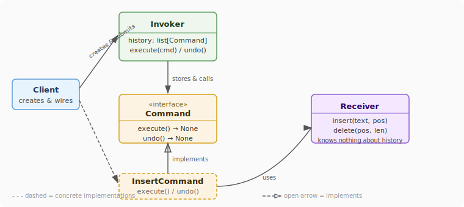
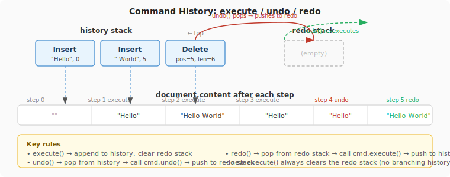
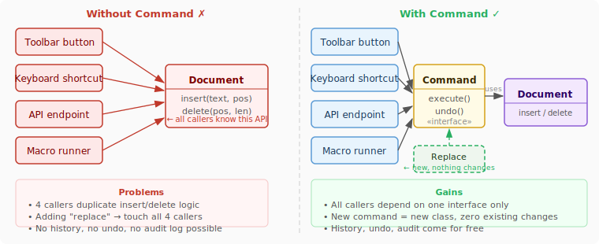

# Command Design Pattern

## 1. What problem are we trying to solve?

You're building a simple text editor. You write this:

```python
class Document:
    def __init__(self):
        self.content = ""

    def insert(self, text: str, position: int) -> None:
        self.content = self.content[:position] + text + self.content[position:]

    def delete(self, position: int, length: int) -> None:
        self.content = self.content[:position] + self.content[position + length:]
```

It works. Then the product manager says: *"Add undo."*

Your first instinct is to add an `undo()` method to the document. But undo *what*? The document has to remember what just happened and how to reverse it. So you add a history log inside the document.

Then: *"Add redo."* Now you need a redo stack too. The document is growing into a mess that mixes "storing text" with "remembering operations" with "reversing operations."

Then: *"Let users record macros — sequences of actions they can replay."* The editor now has to know which actions were taken, in what order, so it can replay them. The document can't possibly own this.

Then: *"Add a toolbar button and a keyboard shortcut that both trigger the same insert action."* Now two different pieces of UI both need to know how to call `document.insert(...)` with the right arguments. You end up duplicating the call in two places, and they can drift.

The core tension is:

> The thing that *decides to do* an action and the thing that *knows how to do* it shouldn't be the same object. And the action itself should be something you can store, pass around, undo, and replay.

That's the problem the **Command pattern** solves.

---

## 2. Concept introduction

The **Command pattern** turns an action into an object.

Instead of directly calling `document.insert("hello", 0)`, you create an object that *represents* that call — its target, its method, its arguments — and hand it to something else to execute.

```
Before:  Button → document.insert("hello", 0)
After:   Button → InsertCommand("hello", 0) → execute() → document.insert("hello", 0)
```

In plain English:

> A Command wraps "do this thing" into a first-class object that can be stored, queued, logged, undone, or replayed — by anyone, at any time.

Command is a **behavioral pattern**. Behavioral patterns are about how objects communicate and who is responsible for what. Command answers:

> How do I decouple the thing that triggers an action from the thing that performs it, while gaining the ability to track, undo, and compose actions?

The four roles:

| Role | Responsibility |
|---|---|
| **Command** | Encapsulates one action — knows `execute()` and `undo()` |
| **Receiver** | The object that actually does the work (e.g., `Document`) |
| **Invoker** | Triggers commands without knowing what they do (e.g., toolbar, scheduler) |
| **Client** | Creates the command objects and wires them to the invoker |



---

## 3. The minimal structure

```python
from abc import ABC, abstractmethod

class Command(ABC):
    @abstractmethod
    def execute(self) -> None: ...

    @abstractmethod
    def undo(self) -> None: ...
```

That's the entire interface. One method to do, one to reverse. Everything else is a concrete command that implements it.

```python
class Document:
    def __init__(self):
        self.content = ""

    def insert(self, text: str, position: int) -> None:
        self.content = self.content[:position] + text + self.content[position:]

    def delete(self, position: int, length: int) -> None:
        self.content = self.content[:position] + self.content[position + length:]


class InsertCommand(Command):
    def __init__(self, document: Document, text: str, position: int):
        self._document = document
        self._text = text
        self._position = position

    def execute(self) -> None:
        self._document.insert(self._text, self._position)

    def undo(self) -> None:
        self._document.delete(self._position, len(self._text))


class DeleteCommand(Command):
    def __init__(self, document: Document, position: int, length: int):
        self._document = document
        self._position = position
        self._length = length
        self._deleted_text = ""  # captured on execute, needed for undo

    def execute(self) -> None:
        self._deleted_text = self._document.content[self._position:self._position + self._length]
        self._document.delete(self._position, self._length)

    def undo(self) -> None:
        self._document.insert(self._deleted_text, self._position)
```

Note that `DeleteCommand` captures the deleted text on `execute()`. This is a key detail: **commands must be self-contained** — `undo()` can't take arguments; it must carry everything it needs to reverse itself from the moment it was executed.

---

## 4. The Invoker — where the history lives

The invoker holds the history stacks. It knows nothing about documents, text, or positions — it just executes commands and remembers them.

```python
class CommandHistory:
    def __init__(self):
        self._history: list[Command] = []
        self._redo_stack: list[Command] = []

    def execute(self, command: Command) -> None:
        command.execute()
        self._history.append(command)
        self._redo_stack.clear()   # a new action invalidates the redo future

    def undo(self) -> None:
        if not self._history:
            return
        command = self._history.pop()
        command.undo()
        self._redo_stack.append(command)

    def redo(self) -> None:
        if not self._redo_stack:
            return
        command = self._redo_stack.pop()
        command.execute()
        self._history.append(command)
```



Now the client code is clean:

```python
doc = Document()
history = CommandHistory()

history.execute(InsertCommand(doc, "Hello", 0))
print(doc.content)   # "Hello"

history.execute(InsertCommand(doc, " World", 5))
print(doc.content)   # "Hello World"

history.undo()
print(doc.content)   # "Hello"

history.redo()
print(doc.content)   # "Hello World"
```

The document knows nothing about history. The history knows nothing about text. The commands bridge them.

---

## 5. Natural example: a bank account

This is the most natural fit for Command because financial systems literally work this way — every action is a recorded transaction that can be audited.

```python
from abc import ABC, abstractmethod
from dataclasses import dataclass, field
from datetime import datetime


class Command(ABC):
    @abstractmethod
    def execute(self) -> None: ...

    @abstractmethod
    def undo(self) -> None: ...


class BankAccount:
    def __init__(self, owner: str, balance: float = 0.0):
        self.owner = owner
        self._balance = balance

    def deposit(self, amount: float) -> None:
        self._balance += amount

    def withdraw(self, amount: float) -> None:
        if amount > self._balance:
            raise ValueError(f"Insufficient funds: have {self._balance}, need {amount}")
        self._balance -= amount

    @property
    def balance(self) -> float:
        return self._balance

    def __str__(self):
        return f"{self.owner}: ${self._balance:.2f}"


class DepositCommand(Command):
    def __init__(self, account: BankAccount, amount: float):
        self._account = account
        self._amount = amount

    def execute(self) -> None:
        self._account.deposit(self._amount)

    def undo(self) -> None:
        self._account.withdraw(self._amount)


class WithdrawCommand(Command):
    def __init__(self, account: BankAccount, amount: float):
        self._account = account
        self._amount = amount
        self._success = False

    def execute(self) -> None:
        self._account.withdraw(self._amount)
        self._success = True

    def undo(self) -> None:
        if self._success:
            self._account.deposit(self._amount)


@dataclass
class AuditedCommandHistory:
    _history: list[tuple[Command, datetime]] = field(default_factory=list)
    _redo_stack: list[Command] = field(default_factory=list)

    def execute(self, command: Command) -> None:
        command.execute()
        self._history.append((command, datetime.now()))
        self._redo_stack.clear()

    def undo(self) -> None:
        if not self._history:
            return
        command, _ = self._history.pop()
        command.undo()
        self._redo_stack.append(command)

    def print_log(self) -> None:
        for cmd, ts in self._history:
            print(f"  [{ts:%H:%M:%S}] {cmd.__class__.__name__}")


# Usage
account = BankAccount("Alice", balance=1000.0)
ledger = AuditedCommandHistory()

ledger.execute(DepositCommand(account, 500))
ledger.execute(WithdrawCommand(account, 200))
print(account)          # Alice: $1300.00

ledger.undo()
print(account)          # Alice: $1500.00 — withdrawal reversed

ledger.print_log()
# [14:03:01] DepositCommand
```

Every action is recorded. You can audit, undo, and extend without touching `BankAccount` at all.

---

## 6. Connection to earlier patterns and SOLID

### What SOLID principles were being broken before

Without Command, callers hold direct references to the receiver and know its full API. Multiple callers duplicate the same calls. Adding a new action requires touching every caller — a clear OCP violation at the *orchestration* layer.



**The precise OCP claim:** Command gives you OCP over the *invoker and the callers*. When you add `ReplaceCommand`, it composes existing primitives (`delete` + `insert`) — nothing existing changes. The only time `Document` grows is when you need a genuinely new low-level primitive that doesn't exist yet (e.g., `format_bold()`). That's the receiver gaining a new capability, not an OCP violation in the Command infrastructure.

| SOLID principle | Without Command | With Command |
|---|---|---|
| **SRP** ✗ | Document mixes text storage + history + undo logic | Each class has one job |
| **OCP** ✗ | Every new action requires touching all callers | New action = new class only |
| **DIP** ✗ | Toolbar depends directly on `Document` | All callers depend on `Command` abstraction |

### Connection to earlier patterns

**Composite** — A sequence of commands (a macro) can itself implement `Command`. That's the Composite Command, which is the next pattern. The invoker treats a macro and a single command identically.

**Memento** — An alternative approach to undo. Instead of each command knowing how to reverse itself, Memento saves a full snapshot of the receiver's state before each command. Command-with-undo is leaner; Memento is more robust when reversals are hard to compute (e.g., image filters).

**Chain of Responsibility (CQS)** — The command's `execute()` is a pure *command* in the CQS sense (returns nothing, changes state). Its `undo()` is also a command. The clean CQS split is what makes commands composable and their history traceable.

**Strategy** — Both encapsulate behavior as objects. The difference: Strategy swaps *how* something is done right now. Command records *what was done* so it can be stored, queued, and undone later.

---

## 7. Example from a popular Python package: SQLAlchemy

**SQLAlchemy's Unit of Work** (the `Session`) uses Command-like queueing. Every ORM operation (`session.add()`, `session.delete()`) queues up a pending change internally. Nothing hits the database until `session.commit()` — at which point the session flushes the command queue in the correct dependency order.

```python
from sqlalchemy.orm import Session

with Session(engine) as session:
    session.add(new_user)       # queued, not executed
    session.add(new_profile)    # queued
    session.commit()            # invoker flushes all commands to the DB
    # session.rollback()        # invoker discards the entire queue
```

`session.commit()` is the invoker's `execute()`. `session.rollback()` is the invoker's `undo()`. The session doesn't care what the commands are — it just knows they support flush and rollback.

`unittest.mock` also records every call as a command-like object in `call_args_list`, letting you assert or replay calls after the fact:

```python
from unittest.mock import MagicMock

service = MagicMock()
service.send_email("alice@example.com", "Hello")
service.send_email("bob@example.com", "Hi there")

print(service.send_email.call_args_list)
# [call('alice@example.com', 'Hello'), call('bob@example.com', 'Hi there')]
```

---

## 8. When to use and when not to use

Use Command when:

| Situation | Why Command helps |
|---|---|
| You need undo/redo | Commands carry their own reversal logic |
| You need to queue or schedule operations | Commands are objects — put them in a queue |
| You need an audit log | Store commands with timestamps |
| Multiple triggers invoke the same action | All share one command class |
| You want to compose actions into macros | Commands compose into Composite Commands |
| You need transactional behaviour | Roll back by calling `undo()` on queued commands |

Do not use Command when:

- Actions are simple, one-off, and never need to be tracked or reversed — a direct method call is clearer.
- The overhead of one class per action is disproportionate to the benefit (e.g., a tiny CLI script).
- You're in a functional context — `functools.partial` or closures may be sufficient.
- There's no clear receiver — you'd just be wrapping a free function with boilerplate.

---

## 9. Practical rule of thumb

> If you ever find yourself writing `last_action = "insert"` and `last_args = (...)` to remember what just happened so you can undo it — stop. That is a hand-rolled Command object. Make it a real one.

Also:

> Every concrete command should capture everything it needs at construction time. `execute()` and `undo()` must take no arguments. If they do, the command isn't self-contained and can't be replayed safely.

The simplest structural test:

```python
command = SomeCommand(receiver, arg1, arg2)
command.execute()    # takes no arguments
command.undo()       # takes no arguments
```

If you're passing arguments to `execute()`, you haven't moved the knowledge into the command yet.

---

## 10. Summary and mental model

The Command pattern turns method calls into objects.

```
Without Command:   caller → receiver.action(args)       ← ephemeral, gone immediately

With Command:      caller → Command(receiver, args)
                                 │
                             stored in history
                                 │
                          execute() → receiver.action(args)
                          undo()    → receiver.reverse(args)
```

**Mental model — think of a written work order:**

```
Without Command:   you walk up to the mechanic and say "change the oil"
                   it happens immediately, there's no record, it can't be undone

With Command:      you write a work order: "change oil on car #42, bay 3, 9am"
                   the work order can be:
                     stored and filed          (audit log)
                     handed to any mechanic    (decoupled from who executes it)
                     cancelled before done     (undo)
                     scheduled for later       (queue)
                     bundled into a service    (composite command / macro)
```

The work order *is* the command. The mechanic *is* the receiver. The service desk *is* the invoker.

| Concept | Role |
|---|---|
| `Command` interface | Guarantees `execute()` and `undo()` exist |
| Concrete command | Captures one action + its receiver + its args |
| Receiver | Does the real work, knows nothing about history |
| Invoker | Stores and fires commands, owns the history stacks |
| Client | Creates and wires commands to the invoker |

In one sentence:

> The Command pattern wraps a method call into an object so it can be stored, queued, logged, undone, or replayed — decoupling who triggers an action from who performs it.

---

[Composite Command →](command_composite.md)
