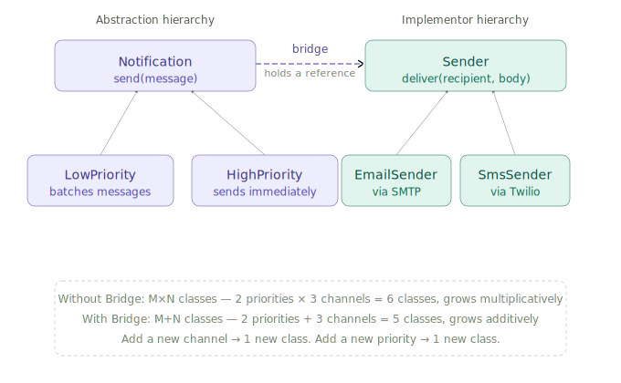

# Bridge Design Pattern

## 1. What problem are we trying to solve?

Imagine you're building a notification system. You have two dimensions of variation:

**Notification types:** email, SMS, push notification
**Priority levels:** low priority (batched), high priority (immediate)

A naive approach using inheritance might produce this class hierarchy:

- `LowPriorityEmailNotification`
- `HighPriorityEmailNotification`
- `LowPrioritySmsNotification`
- `HighPrioritySmsNotification`
- `LowPriorityPushNotification`
- `HighPriorityPushNotification`

That's 6 classes for 3 channels × 2 priorities. Add a third priority level and you've got 9. Add a fourth channel and you've got 12. The number of classes grows multiplicatively — **M × N** — instead of additively.

The deeper problem is that you've fused two separate concerns into one inheritance tree:

- *What* you're sending (the channel: email, SMS, push)
- *How urgently* you're sending it (the priority strategy)

These are independent dimensions of variation. Inheritance can only extend in one direction. When you have two independent dimensions, inheritance creates an explosion.

That's the problem Bridge solves.

---

## 2. Concept introduction

The **Bridge pattern** separates an abstraction from its implementation so that both can vary independently.

In plain English:

> Instead of building one deep inheritance tree that mixes two concerns, split them into two separate hierarchies and connect them with a reference (the "bridge").

Bridge is a **structural pattern**. Structural patterns are about how objects are composed. Bridge answers:

> How do I connect two independently varying hierarchies without fusing them together?

The shape is:

```
Abstraction ─────bridge────► Implementation
     │                              │
     │                              │
 RefinedAbstraction          ConcreteImplementation
```

The "abstraction" is the high-level concept (notification with a priority). The "implementation" is the lower-level mechanism it delegates to (the delivery channel). Neither knows the concrete details of the other — they meet through a shared interface.

The vocabulary:

| Term | Meaning |
|---|---|
| Abstraction | The high-level thing clients use |
| Refined Abstraction | A specific variant of the abstraction |
| Implementor | The interface the abstraction delegates to |
| Concrete Implementor | A specific delivery mechanism |
| Bridge | The reference the abstraction holds to its implementor |



---

## 3. Minimal example

```python
from abc import ABC, abstractmethod


# --- Implementor hierarchy ---

class Sender(ABC):
    @abstractmethod
    def deliver(self, recipient: str, body: str) -> None:
        pass


class EmailSender(Sender):
    def deliver(self, recipient: str, body: str) -> None:
        print(f"[EMAIL] To: {recipient} | {body}")


class SmsSender(Sender):
    def deliver(self, recipient: str, body: str) -> None:
        print(f"[SMS]   To: {recipient} | {body[:160]}")


class PushSender(Sender):
    def deliver(self, recipient: str, body: str) -> None:
        print(f"[PUSH]  To: {recipient} | {body[:100]}")


# --- Abstraction hierarchy ---

class Notification(ABC):
    def __init__(self, sender: Sender):
        self._sender = sender   # <-- the bridge

    @abstractmethod
    def send(self, recipient: str, message: str) -> None:
        pass


class LowPriorityNotification(Notification):
    def __init__(self, sender: Sender):
        super().__init__(sender)
        self._queue = []

    def send(self, recipient: str, message: str) -> None:
        self._queue.append((recipient, message))
        print(f"[QUEUED] {len(self._queue)} message(s) pending")

    def flush(self) -> None:
        for recipient, message in self._queue:
            self._sender.deliver(recipient, f"[Digest] {message}")
        self._queue.clear()


class HighPriorityNotification(Notification):
    def send(self, recipient: str, message: str) -> None:
        self._sender.deliver(recipient, f"[URGENT] {message}")
```

Usage — mix and match freely:

```python
email = EmailSender()
sms = SmsSender()

alerts = HighPriorityNotification(sms)
alerts.send("alice@example.com", "Server is down")
# [SMS]   To: alice@example.com | [URGENT] Server is down

digest = LowPriorityNotification(email)
digest.send("bob@example.com", "Weekly report ready")
digest.send("bob@example.com", "New dashboard published")
digest.flush()
# [EMAIL] To: bob@example.com | [Digest] Weekly report ready
# [EMAIL] To: bob@example.com | [Digest] New dashboard published
```

The key moment is construction — you **inject** the sender into the notification. The two hierarchies only meet at that point. After that, `LowPriorityNotification` has no idea it's talking to an `EmailSender`. It only knows it has a `Sender`.

---

## 4. How the bridge actually works

The bridge is just a reference — `self._sender` in the base class. What makes it the Bridge pattern is the *structural intent*: the abstraction deliberately delegates all channel-specific work to the implementor rather than handling it itself.

Three things must be true:

1. The abstraction holds a reference to the implementor interface, not a concrete class.
2. The abstraction's methods call the implementor's methods — they don't implement channel logic directly.
3. The reference is typically injected at construction time (or via a setter), not created inside the abstraction.

That third point is what allows the two hierarchies to vary independently. You can add `SlackSender` without touching `HighPriorityNotification`. You can add `ScheduledNotification` without touching `EmailSender`.

---

## 5. Natural example — report rendering

Another place Bridge appears naturally is rendering. Reports have two independent dimensions: *content shape* (summary report, detailed report) and *output format* (PDF, HTML, CSV).

```python
from abc import ABC, abstractmethod


class Renderer(ABC):
    @abstractmethod
    def render_title(self, title: str) -> str:
        pass

    @abstractmethod
    def render_row(self, label: str, value: str) -> str:
        pass

    @abstractmethod
    def finish(self, parts: list[str]) -> str:
        pass


class HtmlRenderer(Renderer):
    def render_title(self, title: str) -> str:
        return f"<h1>{title}</h1>"

    def render_row(self, label: str, value: str) -> str:
        return f"<tr><td>{label}</td><td>{value}</td></tr>"

    def finish(self, parts: list[str]) -> str:
        return "<table>" + "".join(parts) + "</table>"


class CsvRenderer(Renderer):
    def render_title(self, title: str) -> str:
        return f"# {title}"

    def render_row(self, label: str, value: str) -> str:
        return f"{label},{value}"

    def finish(self, parts: list[str]) -> str:
        return "\n".join(parts)


class Report(ABC):
    def __init__(self, renderer: Renderer):
        self._renderer = renderer

    @abstractmethod
    def generate(self, data: dict) -> str:
        pass


class SummaryReport(Report):
    def generate(self, data: dict) -> str:
        parts = [self._renderer.render_title("Summary")]
        parts.append(self._renderer.render_row("Total", str(data.get("total", 0))))
        parts.append(self._renderer.render_row("Count", str(data.get("count", 0))))
        return self._renderer.finish(parts)


class DetailedReport(Report):
    def generate(self, data: dict) -> str:
        parts = [self._renderer.render_title("Detailed Report")]
        for key, value in data.items():
            parts.append(self._renderer.render_row(key, str(value)))
        return self._renderer.finish(parts)
```

Usage:

```python
data = {"total": 14_200, "count": 47, "avg": 302, "region": "UK"}

print(SummaryReport(HtmlRenderer()).generate(data))
print(DetailedReport(CsvRenderer()).generate(data))
```

Two report types × two renderers = four combinations, but only four classes total rather than eight. Add a `JsonRenderer` and you immediately get it working with both report types.

---

## 6. Connection to earlier concepts and SOLID

**Bridge and the Adapter pattern** are often confused because both wrap one object inside another. The difference is intent:

| Pattern | Intent | When |
|---|---|---|
| Adapter | Make an existing incompatible interface fit the one you expect | After the fact — you don't control the adaptee |
| Bridge | Decouple two hierarchies that are designed together | Up front — you're designing both sides |

Adapter is a retrofit. Bridge is an architectural choice made early.

**Bridge and Dependency Inversion (DIP)** are closely related. The abstraction depends on the `Sender` interface, not on `EmailSender` or `SmsSender`. This is DIP in action: high-level notification logic doesn't depend on low-level delivery details. Bridge is essentially DIP applied to an entire hierarchy rather than a single class.

**Bridge and Open/Closed (OCP):** adding a new channel (`SlackSender`) doesn't require modifying any `Notification` class. Adding a new priority type doesn't require modifying any `Sender`. Both hierarchies are open for extension and closed for modification — exactly what OCP asks for.

**Bridge and Single Responsibility (SRP):** without Bridge, a `HighPriorityEmailNotification` class has two reasons to change: the urgency logic changes, *or* the email delivery details change. Bridge assigns each reason to its own hierarchy.

---

## 7. Example from a popular Python package

A clean example from the data science world is **matplotlib's backend system**.

Matplotlib separates the *figure/axes abstraction* (what you're drawing: lines, patches, text, legends) from the *renderer/backend* (how it gets drawn: to screen via Qt, to a PNG file, to an SVG file, to a PDF).

The `Figure` and `Axes` objects form the abstraction hierarchy. The backends (`Agg`, `SVG`, `PDF`, `TkAgg`, `Qt5Agg`) form the implementor hierarchy. When you write:

```python
import matplotlib
matplotlib.use("Agg")  # or "SVG", "PDF", "TkAgg" ...

import matplotlib.pyplot as plt

fig, ax = plt.subplots()
ax.plot([1, 2, 3], [4, 5, 6])
fig.savefig("output.png")
```

The `Axes` object doesn't know or care whether it's rendering to screen or a file. It calls abstract renderer methods. The backend (the implementor) handles the actual pixel-pushing or vector-path construction.

You can swap the backend without changing any of the figure-building code — which is exactly what Bridge promises. This is why matplotlib can target so many output formats and GUI toolkits with a single, stable plotting API.

---

## 8. When to use and when not to use

Use Bridge when:

- You have two independent dimensions that both need to vary — channel × priority, format × content-type, platform × feature-set.
- You want to avoid a multiplicative explosion of subclasses (M×N becoming M+N).
- You want to switch the implementation at runtime (inject a different `Sender` without changing the notification).
- You're designing something that will need to support multiple platforms or multiple output targets.

Avoid Bridge when:

- There's only one dimension of variation. If all notifications go through one channel and you only need to vary the priority, a simple inheritance tree is clearer.
- The two "dimensions" aren't actually independent — if every `LowPriorityNotification` *must* use `EmailSender` and can't use anything else, there's no bridge needed.
- The abstraction and implementor are very thin. Don't introduce Bridge for two classes that each have one method. The pattern earns its overhead when both hierarchies are genuinely expected to grow.
- You're early in the design. Bridge is most valuable when you can see the matrix of combinations coming. If you're not sure, start with simple inheritance and refactor to Bridge when the combinatorial pressure appears.

---

## 9. Practical rule of thumb

Ask:

> Am I building a class hierarchy where classes are named with *two* adjectives that come from *two different categories* — like `HighPriorityEmail` or `DetailedHtmlReport`?

If yes, those two adjectives probably belong in separate hierarchies.

Ask:

> When I add a new variant in one dimension, do I have to create N new classes (one per variant in the other dimension)?

If yes, that's the M×N explosion. Bridge reduces it to 1 new class.

Ask:

> Do I want to be able to swap one half of the design at runtime without changing the other half?

Bridge makes that natural — you just inject a different implementor.

---

## 10. Summary and mental model

The Bridge pattern separates a concept (what something *is* or *does*) from its mechanism (how it *works*) by putting them in two connected but independent hierarchies.

Mental model:

```
Abstraction hierarchy:
    What kind of thing is it, and what is its high-level behavior?
    (LowPriorityNotification batches messages)

Implementor hierarchy:
    What mechanism does it use to actually do the work?
    (EmailSender sends via SMTP)

The bridge:
    A reference from the abstraction to the implementor.
    Set at construction. Changed independently.
```

The key contrast with the patterns learned so far:

| Pattern | Main job |
|---|---|
| Adapter | Make an incompatible object fit an expected interface |
| Bridge | Decouple two independent dimensions so both can grow without M×N class explosion |
| Decorator | Add behavior to an object without changing its interface |
| Facade | Simplify a complex subsystem behind one interface |

In one sentence:

> Bridge is useful when you have two independent reasons a class might vary — instead of fusing them into one deep hierarchy, you split them into two shallow ones and connect them with a reference.
