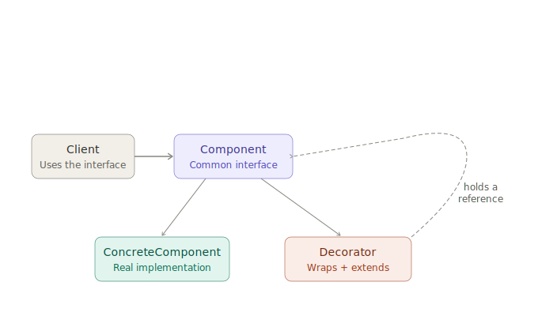
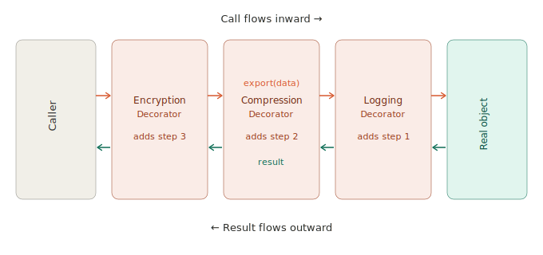

# Decorator Design Pattern

## 1. What problem are we trying to solve?

Imagine you have a simple data exporter that writes records to a CSV file:

```python
class CsvExporter:
    def export(self, data: list[dict]) -> str:
        lines = [",".join(row.values()) for row in data]
        return "\n".join(lines)
```

Now a new requirement arrives: exported data needs to be compressed. Easy enough — add compression. Then another: it should also be encrypted. Then: all exports should be logged for an audit trail.

The naive approach is to keep adding responsibilities to `CsvExporter` until it becomes a tangled class that compresses, encrypts, and logs *as well as* formats data. Or worse, you create a combinatorial explosion of subclasses:

- `CompressedCsvExporter`
- `EncryptedCsvExporter`
- `LoggedCsvExporter`
- `CompressedEncryptedCsvExporter`
- `LoggedCompressedCsvExporter`
- `LoggedEncryptedCompressedCsvExporter`

Six classes for three features. A fourth feature gives you twelve. This is the same M×N explosion Bridge solves for two separate hierarchies — except here all these features apply to *one* object, and they should be combinable freely at runtime.

The problem is:

> How do you add new behaviour to an object without changing its class, while keeping the new behaviour composable and removable at will?

That is the problem **Decorator** solves.

---

## 2. Concept introduction

The **Decorator pattern** attaches additional responsibilities to an object dynamically, without modifying its class or creating subclasses for every combination.

In plain English:

> Wrap an object in another object that implements the same interface. The wrapper adds behaviour before or after calling the wrapped object.

Decorator is a **structural pattern** — it is about how objects are composed. The key insight is that both the wrapper and the wrapped object share the same interface, so the caller cannot tell the difference. You can stack as many wrappers as you like.

The shape is:

```
Client calls  →  Decorator C  →  Decorator B  →  Decorator A  →  Real object
                (adds step 3)    (adds step 2)    (adds step 1)
```

Each layer adds one thing and passes the rest through.



---

## 3. Minimal example

```python
from abc import ABC, abstractmethod


class Exporter(ABC):
    @abstractmethod
    def export(self, data: list[dict]) -> str:
        pass


class CsvExporter(Exporter):
    def export(self, data: list[dict]) -> str:
        lines = [",".join(str(v) for v in row.values()) for row in data]
        return "\n".join(lines)


class ExporterDecorator(Exporter):
    def __init__(self, wrapped: Exporter):
        self._wrapped = wrapped

    def export(self, data: list[dict]) -> str:
        return self._wrapped.export(data)


class LoggingDecorator(ExporterDecorator):
    def export(self, data: list[dict]) -> str:
        print(f"Exporting {len(data)} records...")
        result = self._wrapped.export(data)
        print(f"Export complete: {len(result)} characters")
        return result


class CompressionDecorator(ExporterDecorator):
    def export(self, data: list[dict]) -> str:
        result = self._wrapped.export(data)
        return f"[compressed]{result}[/compressed]"
```

Usage:

```python
data = [{"name": "Alice", "age": "30"}, {"name": "Bob", "age": "25"}]

# Just export
exporter = CsvExporter()

# Export with logging
exporter = LoggingDecorator(CsvExporter())

# Export with logging AND compression
exporter = CompressionDecorator(LoggingDecorator(CsvExporter()))

result = exporter.export(data)
```

Notice that `CompressionDecorator(LoggingDecorator(CsvExporter()))` reads like a description of what is happening. You can reverse the order, remove a layer, or add a new one without touching any existing class.

---

## 4. How the wrapping actually works

The chain works because every layer implements the same interface:

```
exporter.export(data)
    ↓  CompressionDecorator.export(data)
          ↓  LoggingDecorator.export(data)   ← logs "Exporting..."
                ↓  CsvExporter.export(data)
                ↑  returns raw CSV
          ↑  returns raw CSV, logs "Export complete"
    ↑  returns "[compressed]...raw CSV...[/compressed]"
```

Each layer does its work and calls through to the next. The real object sits at the innermost layer. The caller holds a reference to the outermost layer and never knows how many wrappers are in the chain.



The key structural requirements are:

1. Every decorator implements the same interface as the object it wraps.
2. Every decorator holds a reference to a wrapped object of that same interface type.
3. The decorator's method calls the wrapped object's method — it never reimplements the core logic.

---

## 5. Natural example: HTTP middleware

The clearest real-world analogy is HTTP request/response middleware in a web framework. Each layer in the stack is a decorator.

```python
from abc import ABC, abstractmethod


class HttpHandler(ABC):
    @abstractmethod
    def handle(self, request: dict) -> dict:
        pass


class AppHandler(HttpHandler):
    def handle(self, request: dict) -> dict:
        return {"status": 200, "body": f"Hello, {request.get('user', 'guest')}"}


class AuthMiddleware(HttpHandler):
    def __init__(self, inner: HttpHandler, api_keys: set[str]):
        self._inner = inner
        self._keys = api_keys

    def handle(self, request: dict) -> dict:
        if request.get("api_key") not in self._keys:
            return {"status": 401, "body": "Unauthorized"}
        return self._inner.handle(request)


class RateLimitMiddleware(HttpHandler):
    def __init__(self, inner: HttpHandler, limit: int):
        self._inner = inner
        self._calls = 0
        self._limit = limit

    def handle(self, request: dict) -> dict:
        self._calls += 1
        if self._calls > self._limit:
            return {"status": 429, "body": "Too Many Requests"}
        return self._inner.handle(request)


class LoggingMiddleware(HttpHandler):
    def __init__(self, inner: HttpHandler):
        self._inner = inner

    def handle(self, request: dict) -> dict:
        print(f"→ {request.get('method', 'GET')} {request.get('path', '/')}")
        response = self._inner.handle(request)
        print(f"← {response['status']}")
        return response
```

Composition:

```python
handler = LoggingMiddleware(
    RateLimitMiddleware(
        AuthMiddleware(
            AppHandler(),
            api_keys={"secret-key-123"}
        ),
        limit=100
    )
)

response = handler.handle({
    "method": "GET",
    "path": "/hello",
    "api_key": "secret-key-123",
    "user": "Alice",
})
```

Each middleware is independently useful and independently testable. You can reorder them (logging wraps the outside, so it sees every request; rate limiting wraps inside auth, so unauthenticated requests do not count against the rate limit). This is exactly how frameworks like Django, Flask, and FastAPI implement middleware stacks.

---

## 6. Connection to earlier learned concepts and SOLID

### Decorator vs Adapter

Both wrap an existing object, but with opposite goals.

| Pattern | Goal | Changes the interface? |
|---|---|---|
| Adapter | Make an incompatible object fit an expected interface | Yes — translates between two different interfaces |
| Decorator | Add behaviour to an object that already fits the interface | No — preserves the exact same interface |

Use Adapter when the object speaks the wrong language. Use Decorator when the object speaks the right language but you want to extend what it does.

### Decorator vs Bridge

Bridge separates two independent dimensions (abstraction vs. implementation) so both can grow without a class explosion. Decorator stacks behaviour along *one* dimension. Both avoid subclass explosions, but for different structural reasons.

### Decorator vs Inheritance

Inheritance adds behaviour at compile time and for all instances of a class. Decoration adds behaviour at runtime, per instance, and in arbitrary combinations. Decorator is the runtime alternative to subclassing for the purpose of adding behaviour.

### Decorator vs Builder

Builder and Decorator both involve composing things step by step, but they answer opposite questions.

| Question | Builder | Decorator |
|---|---|---|
| What does composition produce? | One finished object | The decorated object itself |
| Does the composing structure stick around? | No — builder is discarded after `build()` | Yes — wrappers are the runtime object |
| Is the intermediate state valid? | Not necessarily — that is why `build()` validates | Yes — every wrapper is a valid, usable object |
| What is being added? | Configuration, fields, validation rules | Behaviour around method calls |

Use Builder when the challenge is *construction* — assembling a valid object from parts. Use Decorator when the challenge is *behaviour extension* — adding orthogonal responsibilities to an already-working object.

A factory or builder can also construct the decorated stack, hiding the layering from the caller:

```python
def build_exporter(format: str, compress: bool, audit: bool) -> Exporter:
    exporter: Exporter = CsvExporter() if format == "csv" else JsonExporter()

    if compress:
        exporter = CompressionDecorator(exporter)
    if audit:
        exporter = LoggingDecorator(exporter)

    return exporter
```

### SOLID principles

**Single Responsibility Principle** — each decorator has one job. `LoggingDecorator` only logs. `CompressionDecorator` only compresses. The CSV formatting stays in `CsvExporter`. Nothing mixes.

**Open/Closed Principle** — adding logging to your exporter does not require modifying `CsvExporter`. The system is open for extension (add a new decorator) and closed for modification (do not touch the existing classes). This is Decorator's strongest SOLID connection.

**Dependency Inversion Principle** — every decorator depends on the `Exporter` abstraction, not on a concrete class. `LoggingDecorator` works whether it wraps a CSV exporter, a JSON exporter, or another decorator.

**Liskov Substitution Principle** — because decorators implement the same interface as the objects they wrap, they are substitutable anywhere the original type is expected. The caller never knows it is holding a decorated object.

---

## 7. Example from a popular Python package

Python's standard library uses Decorator pervasively. The most familiar example is `functools.lru_cache`.

```python
from functools import lru_cache


@lru_cache(maxsize=128)
def compute_fibonacci(n: int) -> int:
    if n < 2:
        return n
    return compute_fibonacci(n - 1) + compute_fibonacci(n - 2)
```

`lru_cache` wraps `compute_fibonacci` and adds caching behaviour. The caller still calls `compute_fibonacci(n)` exactly as before — the interface is identical. Under the hood, the wrapper checks a cache before calling the real function, and stores the result after.

This is structurally identical to the class-based Decorator pattern: same interface, added behaviour, no modification to the wrapped object. Python's `@decorator` syntax makes the wrapping look like an annotation rather than an explicit constructor call.

Another data science example is **scikit-learn pipelines**. A `Pipeline` chains transformers where each step wraps the next. The outer pipeline exposes `fit`, `transform`, and `predict` — the same interface as any single estimator. Steps are added at construction time, and every step is composable, removable, and independently testable.

---

## 8. When to use and when not to use

Use Decorator when:

| Situation | Why Decorator helps |
|---|---|
| You want to add behaviour without modifying existing code | OCP — wrappers extend, they do not change |
| You want to combine behaviours freely at runtime | Stacking wrappers gives you any combination |
| Different objects need different combinations of features | No need for subclasses for each combination |
| Responsibilities should be easy to add and remove | Remove a layer by unwrapping |
| The behaviour you are adding is orthogonal to the core logic | Logging, caching, validation, compression, retry |

Good candidates for decoration:

```
logging / auditing         caching / memoisation
compression / encoding     authentication / authorisation
rate limiting              retry logic
input validation           output formatting
timing / metrics           transaction wrapping
```

Avoid Decorator when:

- The wrapped object's internals need to change, not just its outer behaviour. Decorator adds a shell; it does not reach inside.
- The behaviour depends heavily on the wrapped object's concrete type. If your decorator needs `isinstance` checks or accesses type-specific methods, the abstraction is wrong.
- The wrapping order matters in non-obvious ways and callers must manage it manually. If composition is confusing, a builder or explicit configuration may be clearer.
- You only have one combination of features and it never changes. Then a simple subclass or a single class is clearer.

---

## 9. Practical rule of thumb

Ask:

> Can I describe what I want to add as a verb that wraps around the existing behaviour — "log and then call it", "cache the result of calling it", "retry if calling it fails"?

If yes, Decorator is a natural fit.

Ask:

> Do I need to combine several of these add-ons in different permutations for different objects or contexts?

If yes, Decorator avoids a subclass explosion.

Ask:

> Am I modifying what the object *does*, or how the object *behaves around the edges* of what it already does?

Decorator is for the edges. If you are changing core logic, that is not decoration.

---

## 10. Summary and mental model

Decorator is a structural pattern for adding behaviour by wrapping, not by inheriting.

```
The real thing does its job.
Each wrapper adds one responsibility around it.
The caller sees only the outermost wrapper — but it looks identical to the real thing.
```

Mental model — think of it like gift wrapping:

```
Inner box       = the real object (CsvExporter)
First wrap      = LoggingDecorator
Second wrap     = CompressionDecorator
Third wrap      = EncryptionDecorator

The recipient (caller) handles a package.
They do not know how many layers of wrapping there are.
Each layer adds something without changing what is inside.
```

Compared to the patterns learned so far:

| Pattern | Main job |
|---|---|
| Adapter | Make an incompatible object fit an expected interface |
| Bridge | Decouple two independent dimensions so both can grow without M×N class explosion |
| Decorator | Add behaviour to an object without changing its interface or class |

In one sentence:

> Decorator is the right pattern when you want to add responsibilities to an object at runtime, one layer at a time, without touching the original class and without creating a subclass for every combination.

---

[Exercise 1](exercise1.md) · [Exercise 2](exercise2.md) · [Exercise 3](exercise3.md)
