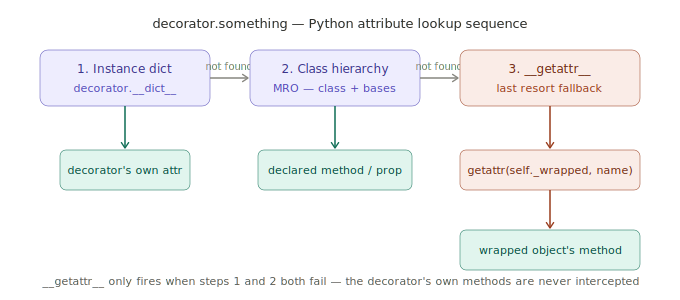
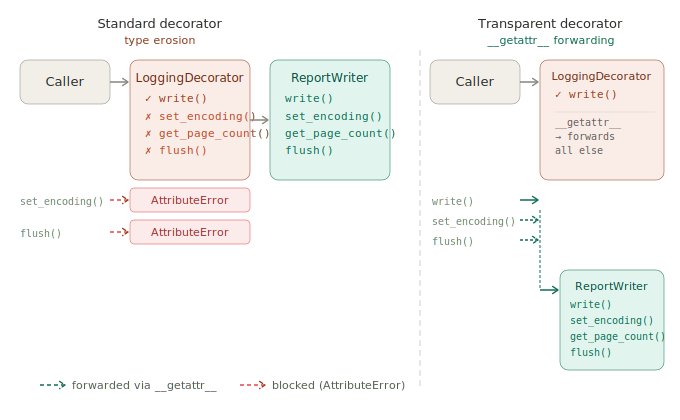

# Transparent Decorator (Dynamic Proxy)

## 1. What problem are we trying to solve?

The standard Decorator pattern works cleanly when you only ever call methods declared on the shared interface. But real objects have richer APIs than what any interface captures.

Suppose you are building a reporting system. You have a `ReportWriter` that writes reports, and you want to add logging around it:

```python
from abc import ABC, abstractmethod


class Writer(ABC):
    @abstractmethod
    def write(self, content: str) -> None:
        pass


class ReportWriter(Writer):
    def write(self, content: str) -> None:
        print(f"Writing: {content}")

    def set_encoding(self, encoding: str) -> None:
        self._encoding = encoding

    def get_page_count(self) -> int:
        return 12

    def flush(self) -> None:
        print("Flushing buffer")


class LoggingDecorator(Writer):
    def __init__(self, wrapped: Writer):
        self._wrapped = wrapped

    def write(self, content: str) -> None:
        print(f"LOG: writing {len(content)} chars")
        self._wrapped.write(content)
```

Now the caller pays a tax for decoration:

```python
writer = LoggingDecorator(ReportWriter())

writer.write("Annual Report")    # works
writer.set_encoding("utf-8")     # AttributeError
writer.get_page_count()          # AttributeError
writer.flush()                   # AttributeError
```

The moment you wrap `ReportWriter`, you lose `set_encoding`, `get_page_count`, and `flush`. The decorator knows nothing about them.

The obvious fix is to proxy every method manually in `LoggingDecorator`:

```python
class LoggingDecorator(Writer):
    def write(self, content: str) -> None:
        print(f"LOG: writing {len(content)} chars")
        self._wrapped.write(content)

    def set_encoding(self, encoding: str) -> None:
        self._wrapped.set_encoding(encoding)

    def get_page_count(self) -> int:
        return self._wrapped.get_page_count()

    def flush(self) -> None:
        self._wrapped.flush()
```

This works, but it is fragile and tedious. Every decorator must be updated whenever `ReportWriter` gains a new method. If you have five decorators, you update all five. If you forget one, you get a silent gap. The decorator is now tightly coupled to the concrete class it is supposed to be decoupled from.

The problem is:

> How do you decorate an object without losing access to any part of its interface — including methods the shared abstract interface does not declare?

---

## 2. Concept introduction

A **transparent decorator** (sometimes called a dynamic proxy) solves type erosion by automatically forwarding any attribute access it does not handle itself down to the wrapped object.

In Python, this is done with `__getattr__`. The rule Python follows when you access `obj.something` is:

1. Look for `something` on the object's own instance dictionary.
2. Look for `something` on the class and its bases (the MRO).
3. If still not found, call `__getattr__("something")` if it is defined.

Step 3 is the hook. A transparent decorator defines `__getattr__` to pass any unrecognised attribute through to the wrapped object. The decorator intercepts what it cares about, and everything else falls through automatically — no manual proxying needed.

In plain English:

> If you ask the decorator for something it does not know about, it asks the wrapped object instead — silently, automatically, for any attribute, method, or property.



---

## 3. The `__getattr__` solution

```python
class LoggingDecorator(Writer):
    def __init__(self, wrapped: Writer):
        self._wrapped = wrapped

    def write(self, content: str) -> None:
        print(f"LOG: writing {len(content)} chars")
        self._wrapped.write(content)

    def __getattr__(self, name: str):
        return getattr(self._wrapped, name)
```

That single `__getattr__` method replaces all the manual proxying. Now:

```python
writer = LoggingDecorator(ReportWriter())

writer.write("Annual Report")      # handled by LoggingDecorator.write
writer.set_encoding("utf-8")       # forwarded to ReportWriter.set_encoding
writer.get_page_count()            # forwarded to ReportWriter.get_page_count
writer.flush()                     # forwarded to ReportWriter.flush
```

The decorator is now transparent. Callers do not need to know or care that the object is wrapped.



---

## 4. How `__getattr__` actually works

It is important to understand precisely when `__getattr__` fires — because it does *not* fire for every attribute access.

Python has two attribute hooks:

| Hook | When it fires |
|---|---|
| `__getattribute__` | On *every* attribute access, no exceptions |
| `__getattr__` | Only when normal lookup has *failed* |

`__getattr__` is the fallback of last resort. This means the decorator's own methods and attributes are never intercepted by it — they are found by normal lookup first. Only attributes the decorator genuinely does not have reach `__getattr__`.

The lookup sequence for `decorator.something`:

```
1. decorator.__dict__           ("something" in instance dict?)
2. type(decorator).__mro__      ("something" on LoggingDecorator or Writer or ABC?)
3. __getattr__("something")     (last resort — forwards to self._wrapped)
```

This is exactly what you want: the decorator handles what it declares, the wrapped object handles the rest.

There is one subtle trap. `__getattr__` fires when accessing `self._wrapped` fails too — which can happen during `__init__` before `self._wrapped` is set, causing infinite recursion. The safe pattern is to ensure `_wrapped` is the very first assignment in `__init__`:

```python
def __init__(self, wrapped):
    self._wrapped = wrapped  # must be first — __getattr__ may fire before this
```

In practice this is rarely a problem, but worth knowing.

---

## 5. A fuller example: the transparent decorator base class

Rather than re-implementing `__getattr__` in every decorator, put it in a shared base:

```python
from abc import ABC, abstractmethod


class Writer(ABC):
    @abstractmethod
    def write(self, content: str) -> None:
        pass


class WriterDecorator(Writer):
    def __init__(self, wrapped: Writer):
        self._wrapped = wrapped

    def write(self, content: str) -> None:
        self._wrapped.write(content)

    def __getattr__(self, name: str):
        return getattr(self._wrapped, name)


class LoggingDecorator(WriterDecorator):
    def write(self, content: str) -> None:
        print(f"LOG: writing {len(content)} chars")
        self._wrapped.write(content)


class CompressionDecorator(WriterDecorator):
    def write(self, content: str) -> None:
        compressed = f"[compressed]{content}[/compressed]"
        self._wrapped.write(compressed)
```

Now `LoggingDecorator` and `CompressionDecorator` only declare what they actually change. Everything else on `ReportWriter` passes through automatically:

```python
class ReportWriter(Writer):
    def write(self, content: str) -> None:
        print(f"Writing: {content}")

    def set_encoding(self, encoding: str) -> None:
        print(f"Encoding set to {encoding}")

    def get_page_count(self) -> int:
        return 12

    def flush(self) -> None:
        print("Flushing")


writer = CompressionDecorator(LoggingDecorator(ReportWriter()))

writer.write("Q4 Report")     # handled by each decorator in turn
writer.set_encoding("utf-8")  # passes through both decorators to ReportWriter
writer.get_page_count()       # passes through both decorators to ReportWriter
writer.flush()                # passes through both decorators to ReportWriter
```

The two decorators do not know about `set_encoding`, `get_page_count`, or `flush` — and they do not need to. `__getattr__` on each layer forwards to the next until it reaches an object that does know.

---

## 6. Natural example: a caching layer over a repository

A transparent decorator is particularly valuable when decorating objects with large, stable interfaces — like a repository.

```python
from __future__ import annotations
from dataclasses import dataclass


@dataclass
class Product:
    id: int
    name: str
    price: float


class ProductRepository:
    def find_by_id(self, product_id: int) -> Product | None:
        print(f"DB: querying product {product_id}")
        return Product(id=product_id, name="Widget", price=9.99)

    def find_by_name(self, name: str) -> list[Product]:
        print(f"DB: querying products named '{name}'")
        return []

    def save(self, product: Product) -> None:
        print(f"DB: saving product {product.id}")

    def delete(self, product_id: int) -> None:
        print(f"DB: deleting product {product_id}")

    def find_all(self) -> list[Product]:
        print("DB: fetching all products")
        return []

    def count(self) -> int:
        print("DB: counting products")
        return 42
```

A caching decorator only cares about `find_by_id`. Everything else — `find_by_name`, `save`, `delete`, `find_all`, `count` — it should leave alone. Without `__getattr__`, you would need to proxy all six methods. With it:

```python
class CachingRepository:
    def __init__(self, wrapped: ProductRepository):
        self._wrapped = wrapped
        self._cache: dict[int, Product] = {}

    def find_by_id(self, product_id: int) -> Product | None:
        if product_id not in self._cache:
            self._cache[product_id] = self._wrapped.find_by_id(product_id)
        else:
            print(f"CACHE: hit for product {product_id}")
        return self._cache[product_id]

    def __getattr__(self, name: str):
        return getattr(self._wrapped, name)
```

Usage:

```python
repo = CachingRepository(ProductRepository())

repo.find_by_id(1)              # DB: querying product 1
repo.find_by_id(1)              # CACHE: hit for product 1
repo.find_by_name("Widget")     # forwarded straight to DB
repo.count()                    # forwarded straight to DB
repo.save(Product(2, "Gadget", 19.99))  # forwarded straight to DB
```

The caching decorator declares one method. The repository's full interface remains accessible through zero manual proxying.

---

## 7. Connection to earlier learned concepts and SOLID

### Transparent Decorator vs standard Decorator

Standard Decorator requires the shared interface to cover everything callers might need. Transparent Decorator removes that constraint — the shared interface only needs to cover what decorators intercept. Everything else passes through. Transparent Decorator is a more pragmatic version of the same pattern for real-world objects whose full interface you do not control or do not want to replicate.

### Transparent Decorator vs Adapter

An Adapter uses `__getattr__`-style forwarding too — it wraps an incompatible object and exposes a different interface. The difference is intent:

| Pattern | Intent | Changes the interface? |
|---|---|---|
| Adapter | Translate between two different interfaces | Yes |
| Transparent Decorator | Extend behaviour while preserving the full original interface | No |

If you are forwarding everything and translating nothing, it is a transparent Decorator. If you are renaming methods and reshaping return values, it is an Adapter.

### SOLID principles

**Single Responsibility Principle** — each decorator still does one thing. `CachingRepository` only caches. It does not need to know about saving, deleting, or counting — those responsibilities remain in `ProductRepository` and reach callers transparently.

**Open/Closed Principle** — when `ProductRepository` gains a new method, zero decorators need updating. The `__getattr__` fallback handles new methods automatically. This is a stronger OCP guarantee than the standard Decorator, which would require every decorator to add a forwarding method.

**Dependency Inversion Principle** — `CachingRepository` still depends on the abstraction. The `__getattr__` fallback uses `getattr(self._wrapped, name)`, which works on any object — not just `ProductRepository`.

**Interface Segregation Principle** — the shared interface can remain minimal, covering only what decorators actually need to intercept. Callers who need the full interface get it through the transparent fallback, not through an artificially bloated abstract base class.

---

## 8. Example from a popular Python package

Python's `unittest.mock.MagicMock` is one of the most widely-used transparent proxy implementations. When you access any attribute on a `MagicMock`, it does not raise `AttributeError` — it dynamically creates and returns a new mock for that attribute. This is `__getattr__` in action:

```python
from unittest.mock import MagicMock

repo = MagicMock(spec=ProductRepository)

repo.find_by_id(1)        # auto-creates a mock method, returns a mock
repo.count()              # same — no AttributeError
repo.anything_at_all()   # same — fully transparent to any attribute access
```

A closely related real-world example is **SQLAlchemy's lazy-loading proxies**. When you access a relationship attribute on a model instance that has not been loaded yet, SQLAlchemy's instrumentation intercepts the access via `__getattr__`-equivalent machinery, fires a database query, and returns the result — all transparently. The caller just accesses `order.customer` and gets back a `Customer` object, with no idea that a query happened.

---

## 9. When to use and when not to use

Use a transparent decorator when:

| Situation | Why transparent decoration helps |
|---|---|
| The wrapped object has a large interface | Avoids proxying dozens of methods manually |
| You only need to intercept a few methods | `__getattr__` handles everything you do not override |
| The wrapped object's interface changes over time | New methods work automatically with no decorator updates |
| You do not own or control the wrapped class | Cannot make it implement your interface — forward everything else |
| You are decorating third-party objects | Their interface is not yours to define |

Be cautious when:

- **Static type checking matters.** `__getattr__` is invisible to mypy and pyright. The type checker sees `LoggingDecorator`, which does not declare `set_encoding`, and will flag `writer.set_encoding(...)` as an error even though it works at runtime. You can address this with `__getattr__` type stubs, but it adds friction.
- **The interface must be contractually enforced.** If callers must only use methods the decorator declares, transparent forwarding is too permissive — it lets anything through.
- **Performance is critical.** Every forwarded attribute access goes through `__getattr__`, which is slower than a direct method call. For tight loops over large datasets this can matter.
- **The wrapped object has private or internal methods you should not expose.** Transparent forwarding exposes everything, including internals. If the wrapped object has methods that are implementation details, forwarding them to callers may create a leaky abstraction.

---

## 10. Practical rule of thumb

Ask:

> Am I writing forwarding methods that do nothing but call the same method on `self._wrapped`?

If yes, delete them and use `__getattr__` instead.

Ask:

> Is my decorator only intercepting a small subset of the wrapped object's methods?

If yes, `__getattr__` forwarding saves you from proxying everything else.

Ask:

> Does the wrapped object's interface change independently of my decorator?

If yes, transparent decoration means your decorator stays correct automatically when new methods are added.

Ask:

> Do I need static type safety for the forwarded methods?

If yes, you will need to add type stubs or consider whether transparent decoration is the right trade-off.

---

## 11. Summary and mental model

Type erosion is the cost of standard Decorator: wrapping an object hides everything the shared interface does not declare. Transparent Decorator eliminates that cost by making `__getattr__` the forwarding mechanism, so the decorator only needs to declare what it actually changes.

```
Standard Decorator:
    declare every method you want callers to reach
    anything undeclared is invisible

Transparent Decorator:
    declare only the methods you intercept
    everything else passes through automatically
```

Mental model — think of a one-way mirror:

```
Standard Decorator:    an opaque box — only what you cut holes in is visible
Transparent Decorator: a one-way mirror — you see everything on the other side,
                       but you can paint over the parts you want to intercept
```

In one sentence:

> A transparent decorator uses `__getattr__` to forward any attribute it does not handle to the wrapped object, so the decorator only needs to declare what it intercepts — not everything the wrapped object knows how to do.

---

[Back to Decorator](decorator.md) · [Exercise 1](exercise1.md) · [Exercise 2](exercise2.md)
